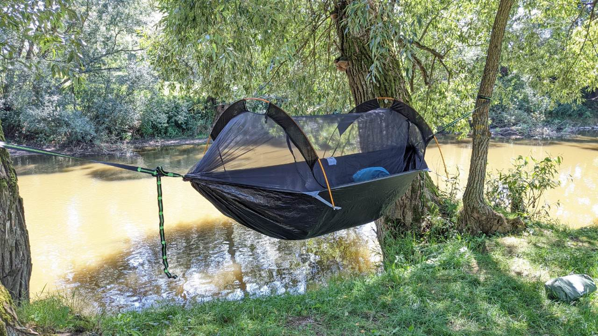

# Die Vorbereitungen laufen
##### By G.dot
_Published on 2022-08-27T11:00:00.001+02:00_

  
Was nimmt man mit? Wie viele Kleidungsstücke braucht man? Braucht ich einen Schlafsack?

Ich habe mich für Unabhängigkeit entschieden und nehme das ganze Schneckenhaus mit. Schlafsack, Isomatte und Zelt. Nun, da ein Zelt dich Recht schwer ist, probiere ich eine Hängematte. Im Urlaub werde ich sie testen. Mal sehen, ob man darin gut schlafen kann.

  

Update:

Man kann. Allerdings ist die Kombination von relativ steifer Luftmatratze und der hängenden Matte nicht optimal. Und ohne Isolation nach unten wird es kalt. Man kann das Teil auch als Minizelt aufstellen. Das passt prima. 1.8kg Freiheit kommen mit.

---
Categories: Ausrüstung,Planung