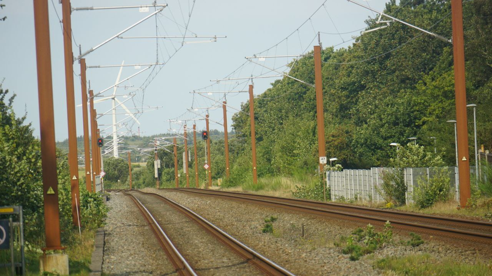
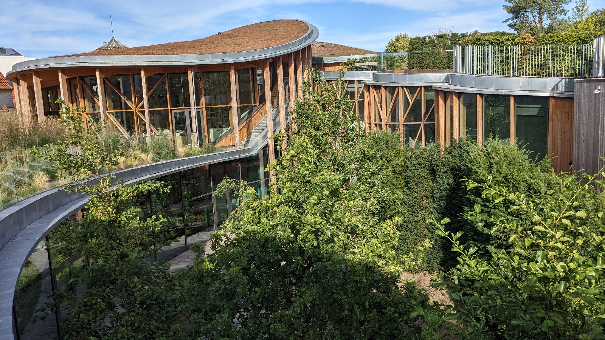
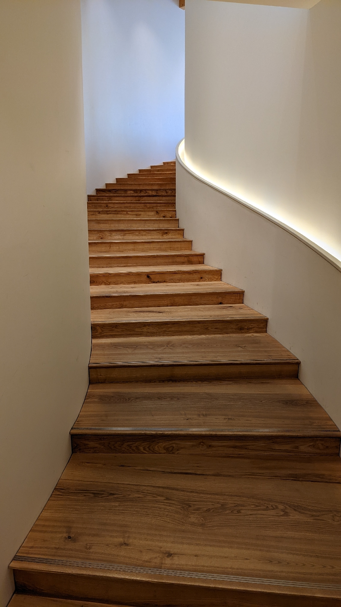
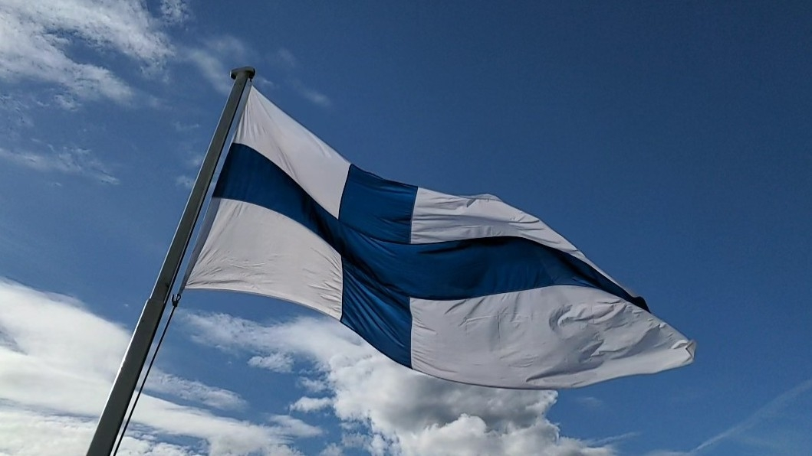

# Danske Design
##### By G.dot
_Published on 2022-09-07T16:14:00.001+02:00_

Die Dänen sind offenbar verliebt in tolles Design. Das ist nichts schlechtes. Nur ungewohnt für jemanden, der da aufgewachsen ist, wo selbst die [Neubauten barock sein müssen](https://de.wikipedia.org/wiki/Neumarkt_%2528Dresden%2529?wprov=sfla1) und im Vorort die Baumarkttür der Ästhetik Krone ist.

Hier in Dänemark sind selbst die Masten der Eisenbahn oder öffentliche Mülleimer aus Corten-Stahl.

[Hans Christian Andersen](https://de.wikipedia.org/wiki/Hans_Christian_Andersen) bekam ganz frisch ein beeindruckendes Museum in Odense. Erlebenswert!

  

Architektur von Kengo Kuma

  

Andersen, so lerne ich dort, hat auf ausgedehnten Reisen seine Inspirationen gefunden. Wenn das mal kein Zeichen ist...

Trotzdem lasse ich Dänemark rasch hinter mir. Durchquere Schweden bis Stockholm, um mich dort nach Helsinki einzuschiffen. 

---
Categories: Kultur,Länder,Reise