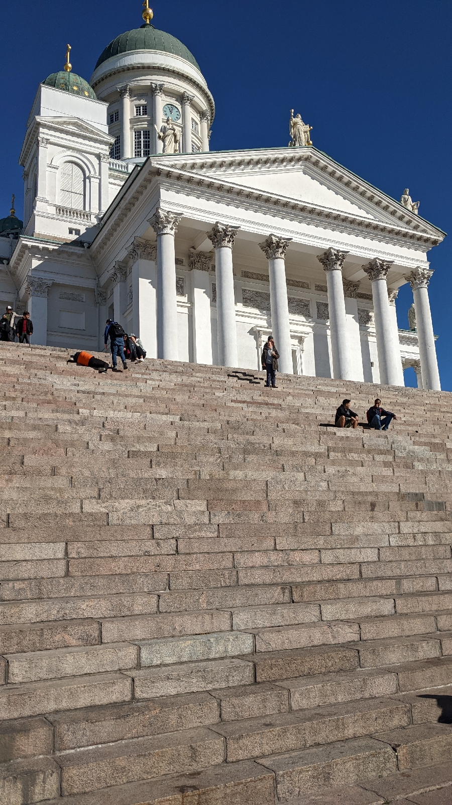
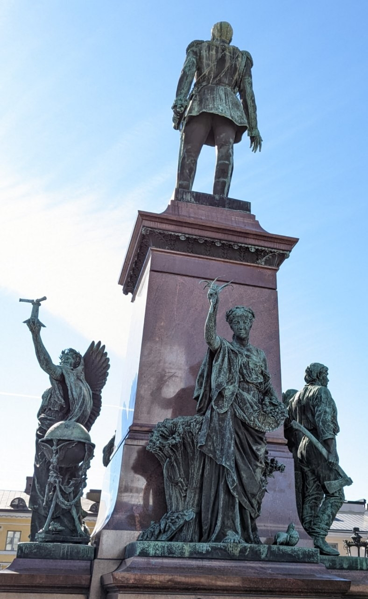
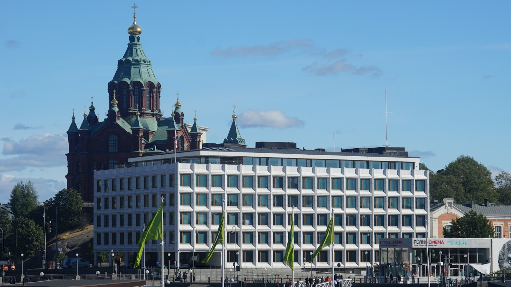
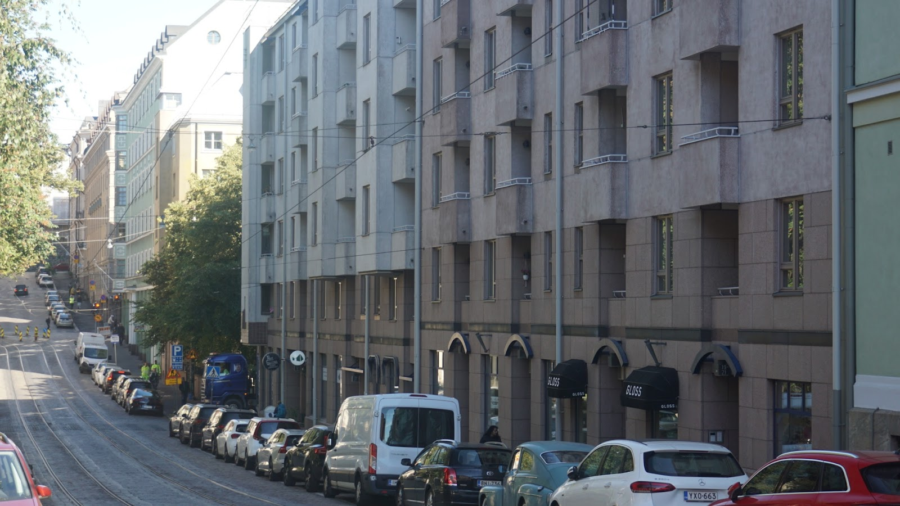
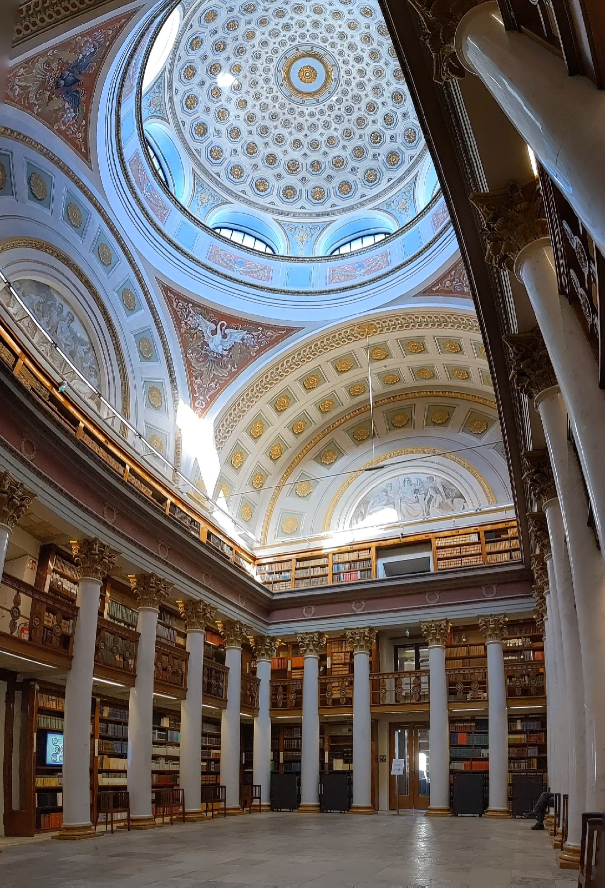
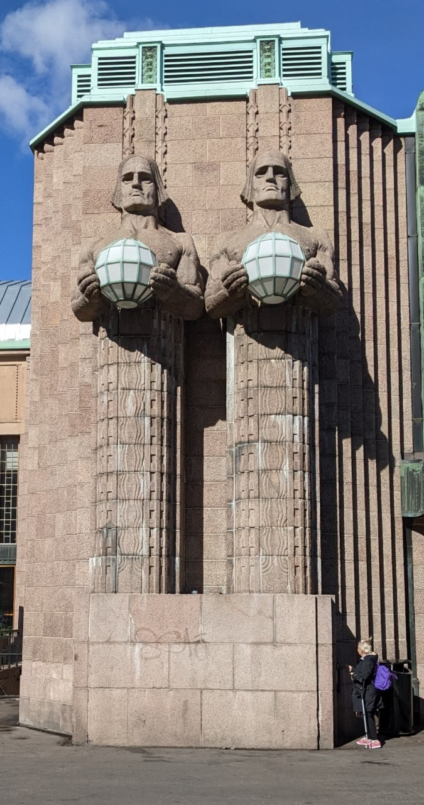
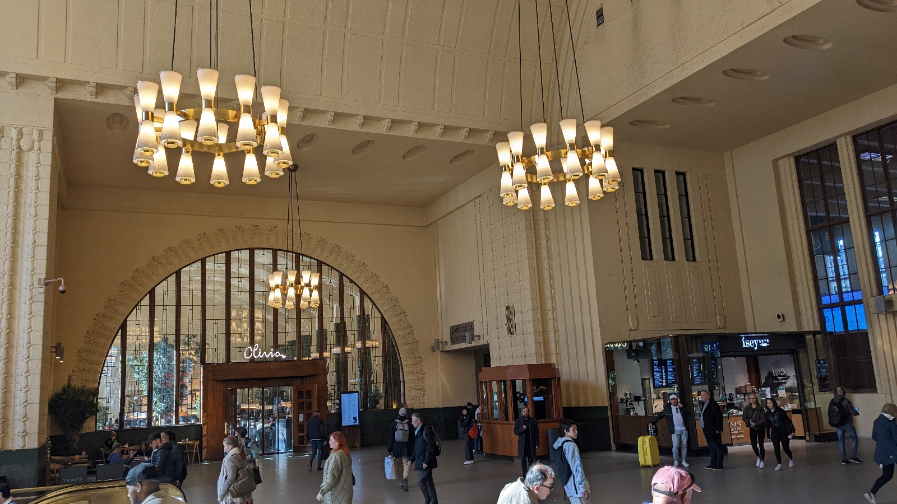
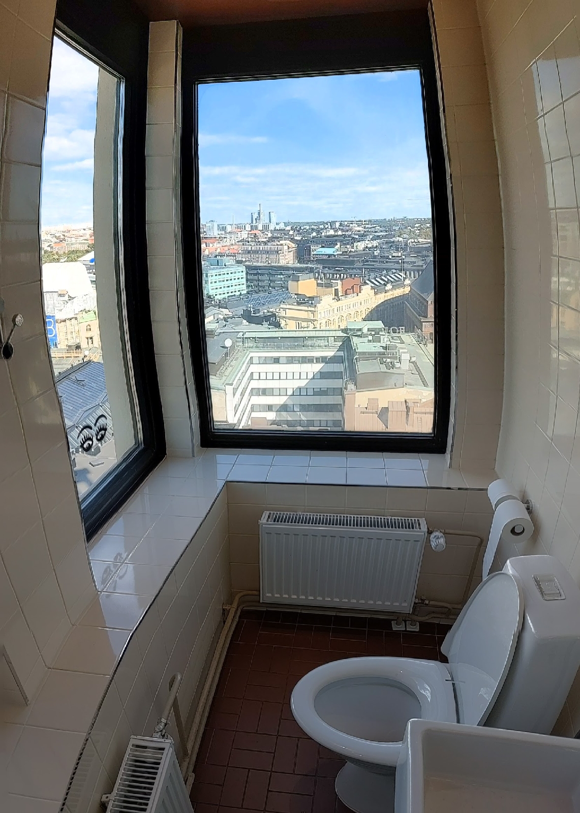
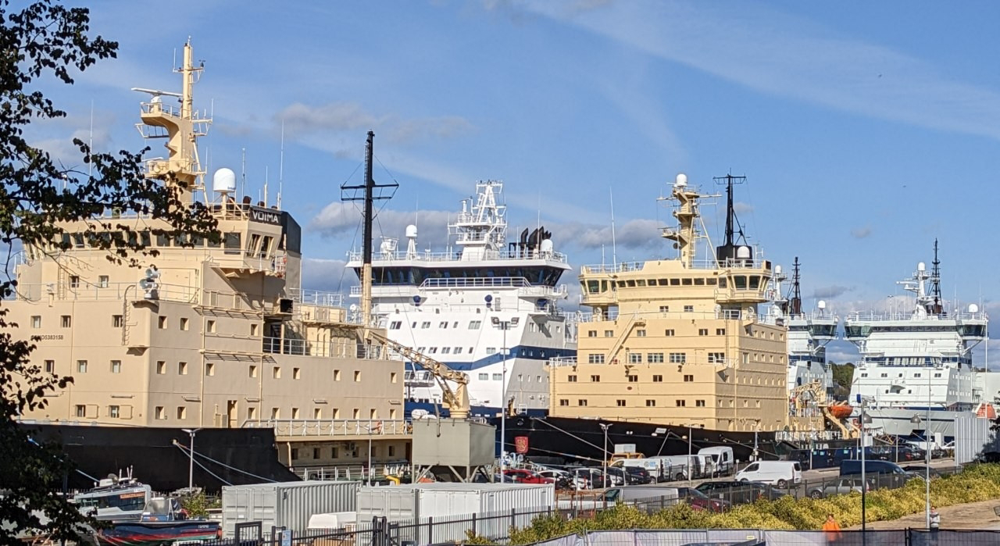

# Impressionen aus Helsinki
##### By G.dot
_Published on 2022-09-09T10:31:00.000+02:00_

War in Dänemark Design und Moderne noch allgegenwärtig, zeigen sich die in der finnischen Hauptstadt erst auf den zweiten Blick. Der erste sagt: praktisch statt hübsch

  

Die Stadt erscheint als eine Mischung aus nordischer Kühle und zaghafter großstädtischer Lebensart. Wuchtige Bauten erzählen von Stolz. Eher versteckt findet man architektonische Perlen. Ein paar Bilder:

  

Eiszeitliche Granitklippen erlauben wuchtige Monumentalbauten

  

Die Russen waren schon da. Alexander II umgibt sich hier mit Allegorien auf Recht, Arbeit, Kunst und Frieden. Letzterer wendet er seit 1894 den A... zu. 

  

Orthodoxie wie derbe Moderne überall.

  

Nordisch praktische Wohnblocks

  

eine Perle: Der Lesesaal der Nationalbibliothek

  

Helsinki hatte einen heftigen Flirt mit dem Jugendstil. Man findet viele sehr eigene Zeugen in der Stadt. Die hier bewachen den Hauptbahnhof...  

... Ein Tempel des Aufbruchs.

  

  

Das heute beschert uns ein Örtchen mit exzellenter Übersicht von Hotel Torni.

  

übersommernde Eisbrecher

  

Was mir gefiel:

Zentrum recht kompakt, kurze Wege, Stadtrundfahrt mit Straßenbahn 2/3 ideal, überall Zebrastreifen

und was nicht:

Viele Pflasterstraßen - Radfahren nur für Harte

Kaffee ist teuer (wie vieles andere auch).

---
Categories: Länder