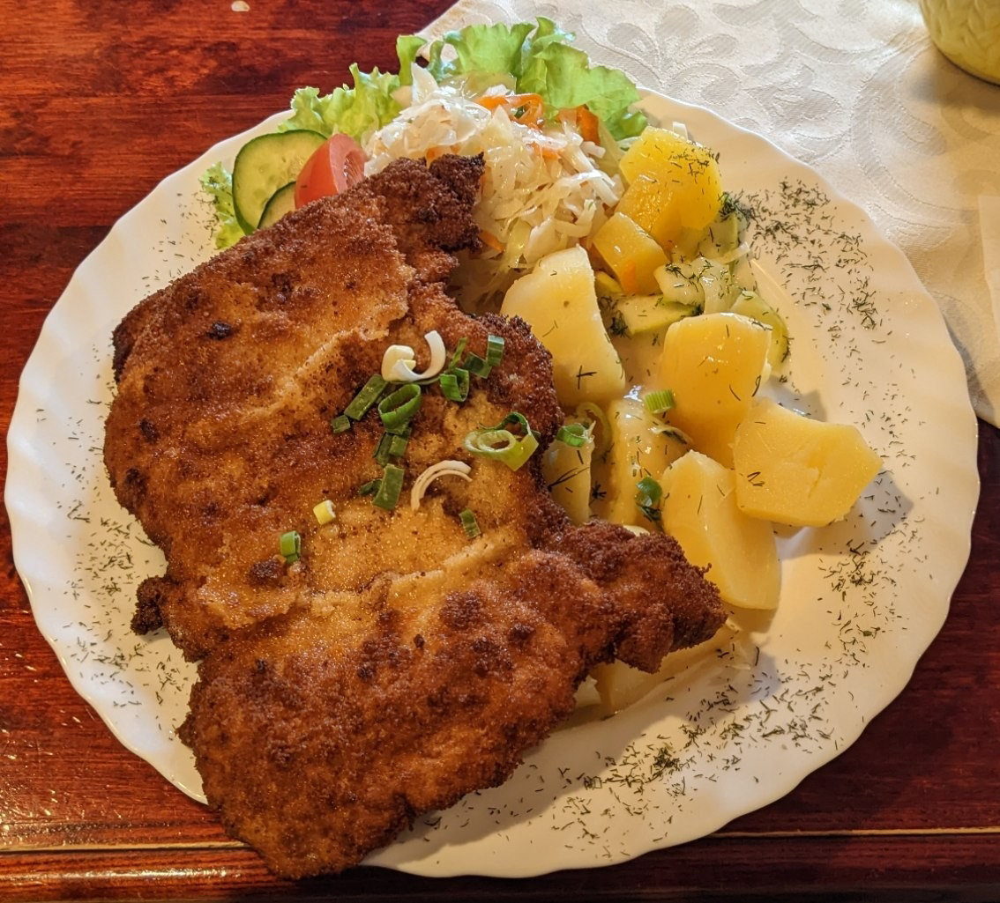
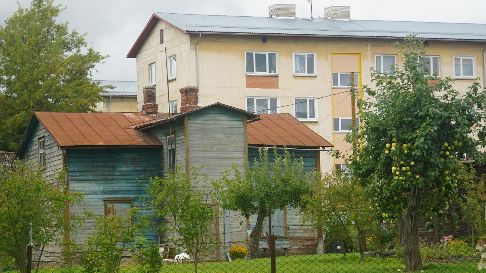
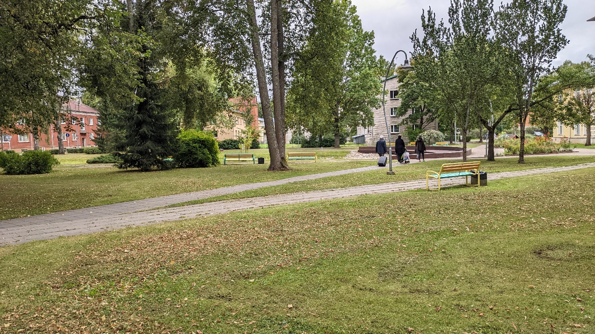

# nizel statt Rail Baltica
##### By G.dot
_Published on 2022-09-12T14:38:00.002+02:00_

Eisenbahn ist eine komplexe Sache. Ganz besonders unschön wird es, wenn man quasi bei Null anfangen muss. Die Bahn der baltischen Staaten wurde zu Sowjetzeiten gebaut. Deren Spurweite, also der Abstand zwischen den beiden Schienen, ist größer als in Mitteleuropa üblich. Will man also einen Zug von Tallinn nach Warschau fahren lassen, muss man irgendwo den Zug wechseln. Ist man EU-Mitglied und will so richtig zum Westen gehören, ist das unschön. Alle Gleise im Land wechseln ist aber ein dickes Brett.

Daher kam die EU und fördert den Bau einer Neubaustreche. _[Rail Baltica](https://de.wikipedia.org/wiki/Rail_Baltica)_ wurde die getauft und sollte dieses Jahr in Betrieb gehen. Wenn wundert's, dass auch dieses Projekt um Jahre verzögert ist. 

Deshalb darf ich mir den netten Grenzort Valga zwischen Estland und Lettland vier Stunden lang anschauen. Eine durchgehende Verbindung zwischen den beiden Ländern gibt es nicht.

Diese Entschleunigung belohnte mich aber mit Eindrücken aus der Provinz und einen exzellenten Riesenschnitzel.

Chruschtschowkas nennt der Volksmund die schnell hochgezogenen Wohnblocks. Der harmonischen Integration in die bestehende Bebauung wurde ähnlich viel Beachtung geschenkt wie in Prohlis oder französischen Skiorten.

Die Parks aber sind 1A gepflegt.

---
Categories: Geschichte,Länder,Technik