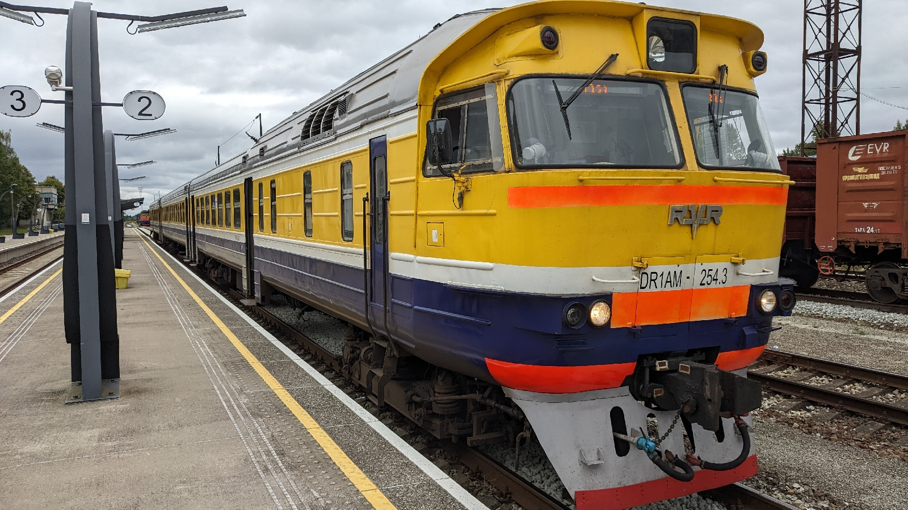
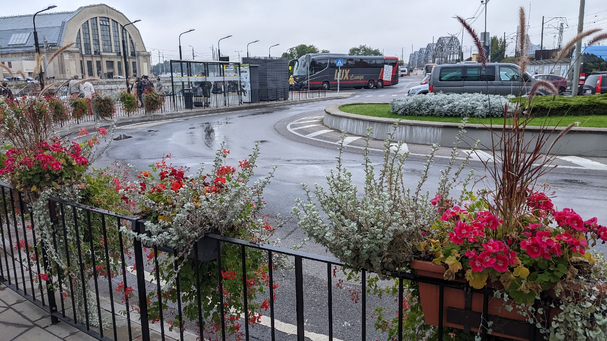
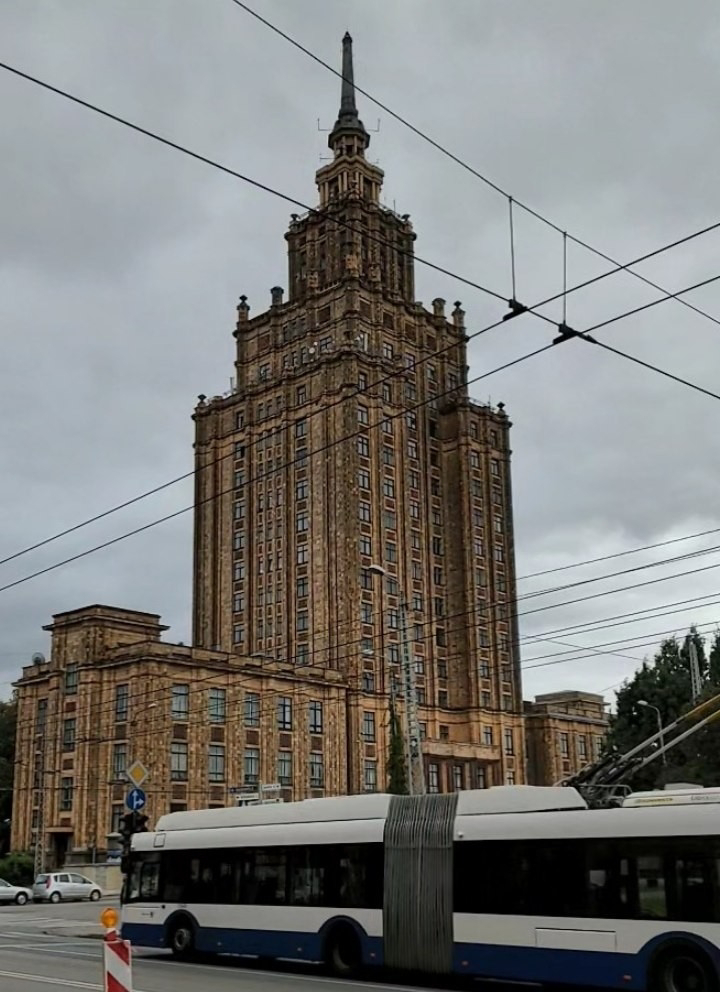
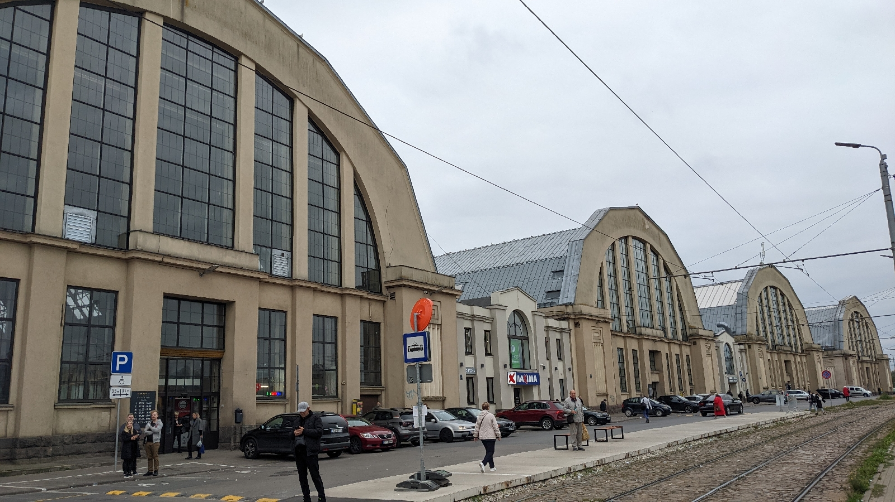

# In Busland
##### By G.dot
_Published on 2022-09-15T13:29:00.001+02:00_

Ja, die Rechtschreibung stimmt. Die Wortschöpfung wähle ich für Lettland. Von Riga kommt man selbst nach Meinung der Dame am Fahrkartenschalter im Bahnhof nur per Bus über die Landesgrenze nach Süden. Schon die Zugfahrt ab der estnischen Grenze glich einer Zeitreise 60 Jahr zurück.

Also ergebe ich mich und fahre vier Stunden Bus nach Litauen.  

Die Zuneigung zum Straßenverkehr kann man vielleicht auch an dem liebevoll mit Blumen geschmückten Busbahnhof ablesen.

Rīga selbst ist schon eine echte, laute Großstadt mit deutlich sichtbaren sowjetischen Hinterlassenschaften wie _Stalins Geburtstagstorte_ und dem O-Bus.

Aber Riga hat mehr zu bieten. Eine beeindruckende Altstadt (wenn auch vieles nach Kriegszerstörunge wiedererrichtet wurde) und ein wildes Jugendstil-Ensemble. Mein Highlight waren aber die zu einem gigantischen Markt umgenutzten ehemaligen Zeppelinhallen.

---
Categories: Länder,Reise,Technik