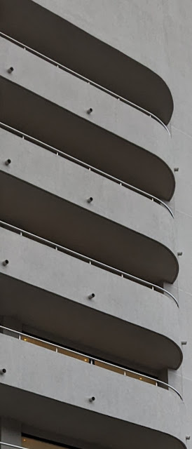
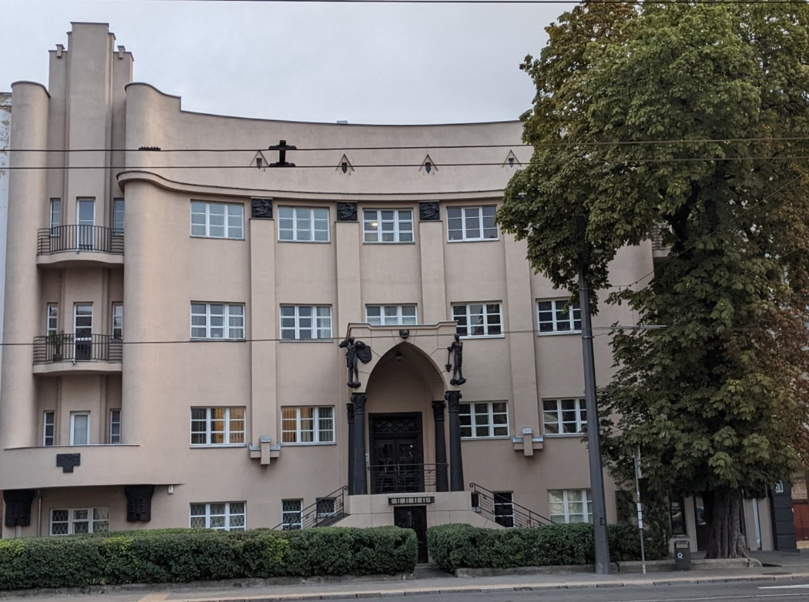
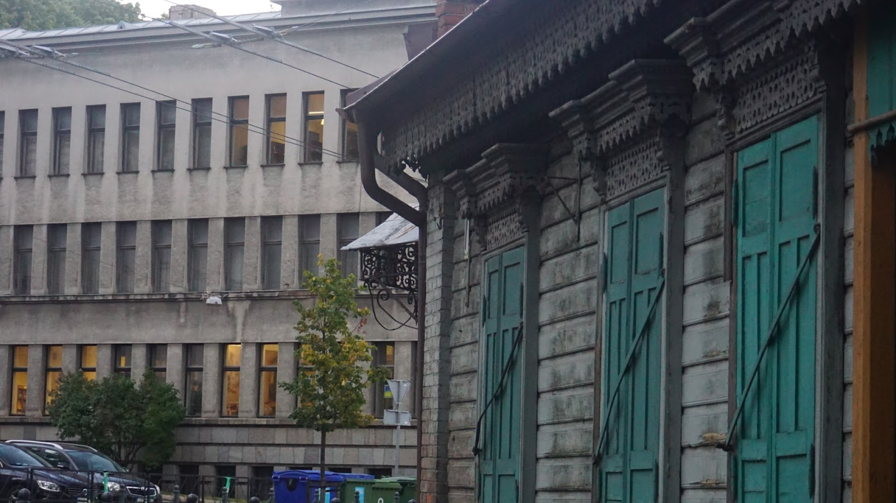

# Kaunas modern
##### By G.dot
_Published on 2022-09-17T08:45:00.002+02:00_

Hatten Rīga und Helsinki heftige Flirts mit den Jugendstil, so war es in Kaunas die Moderne, die das Stadtbild Straßen mit prägt.

  

Daß ich das entdeckt durfte, verdanke ich dem dünnen litauischen Fahrplan der Bahn. Nach Bialystok in Polen fährt der Zug nur ein Mal pro Woche! Kaunas ist Litauens Verkehrsknoten Richtung Westen. Also mache ich hier Station und das lohnt sich durchaus. Der Stadt hat erst der russische Zar seinen Stempel aufgedrückt. Es wurde Festung und Garnisonsstadt. Nach der Unabhängigkeit 1920 versuchten sich litauische Architekten in ihrer ganz eigenen Interpretation modernen Bauens.

Sehenswert.

Weiteres findet man hier: https://autc.lt/en/architecture-object/?id=881

  

  

---
Categories: Geschichte,Kultur,Länder