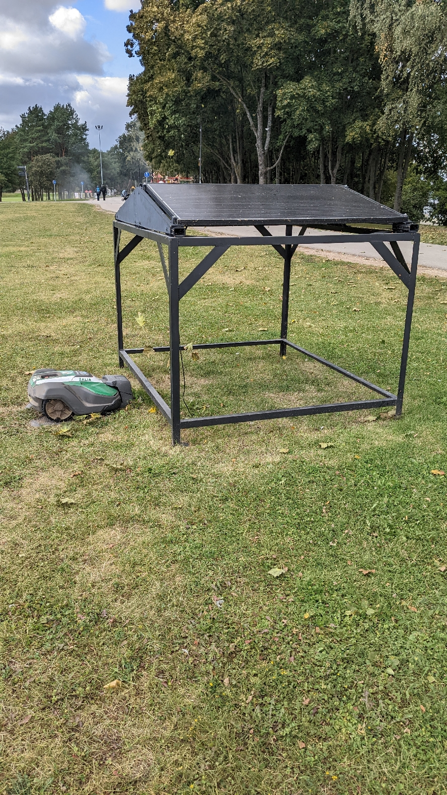
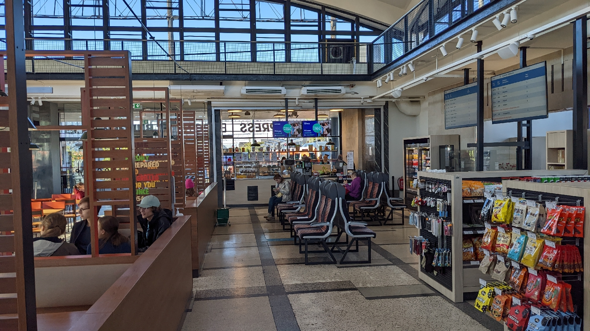
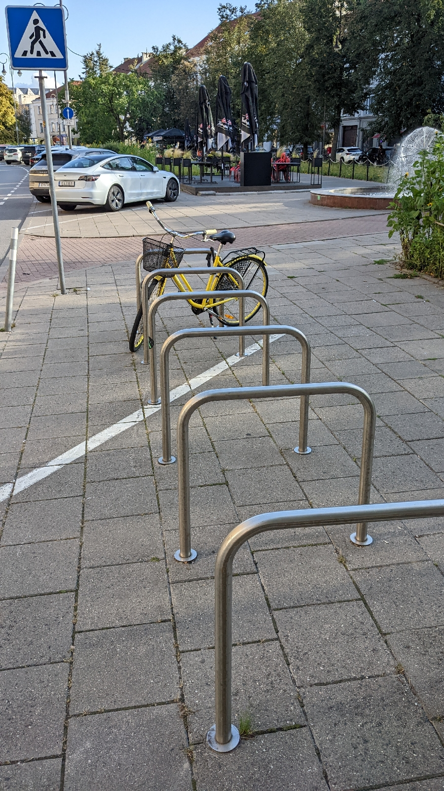

# Wende-Energie
##### By G.dot
_Published on 2022-09-19T17:54:00.002+02:00_

Schaut man in Deutschland aus dem Zugfenster, ist meist ein Windrad zu sehen. Im Baltikum haben die Seltenheitswert. Ich habe dort ganze vier Stück gesehen. Eins drehte sich. Auch ein Dach mit Solarmodulen war nirgends in Sicht.

Nur der Mähroboter darf Sonne tanken. Wollte ich mit dem Elektroauto von Deutschland nach Tallinn fahren, bliebe ich wohl liegen oder müsste Tage an Schukosteckdosen verbringen.

Litauen und Estland liegen bei einem [Drittel Deutschlands](https://ourworldindata.org/grapher/wind-electricity-per-capita) (Windenergie pro Einwohner) Lettland weit darunter. Wasserkraft fällt im Flachland auch aus. Deren erneuerbare Energie kommt laut Statistik aus Biomasse. Wahrscheinlich verfeuern sie ihre Wälder. Dabei gibt es dort viel und stetig Wind. 

  

Beim Verkehr sieht es ähnlich traurig aus. Dicke Karren sind sehr in. Dabei ist Benzin nicht viel günstiger als in Deutschland. Die Einkommen aber weit weniger als halb so hoch. Züge fahren, wenn überhaupt, nur zwischen den wichtigsten Städten und das auch Recht selten. Die sind dann aber gut gefüllt. 

Der Bahnhof von Tallin ist ein einziger großer Burger King. Verschämt am Rande gibt es einen Fahrkartenschalter mit einer gelangweilt unfreundlichem Dame dahinter.

Grenzüberschreitende Züge gibt es nicht. Zwischen Litauen und Lettland ist man auf Bus angewiesen. Der scheint hier überall das Hauptverkehsmittel für Fernreisen ohne eigenes Auto zu sein. Dabei gab es diese Züge mal.

  

Im den Städten haben Radfahrer Seltenheitswert (wie hier in Vilnius downtown - aber ein Tesla im Hintergrund ;~) In Tallin sah ich immerhin ein paar Radwege.

Ich habe den Eindruck, diese Länder stecken gedanklich noch in der Nachwende-Pupertät. Der Nachholbedarf an Freiheit, Geld verdienen und Konsumieren war und ist riesig. Scheinbar gibt es keine Abkürzung vom Kommunismus zum Klimaschutz. Jede Entwicklungsphase muss dem Westen nachgemacht werden.

Bleibt zu hoffen, sie lernen schneller als wir.

---
Categories: sonstiges,Technik