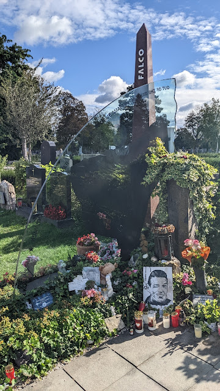

# Baby leih mir deinen Lader
##### By G.dot
_Published on 2022-09-20T08:46:00.001+02:00_

Kultur, Natur, bezahlbare Wohnungen, Radwege, günstige Öffis - Wien hat alles, um zu Recht ganz oben auf der [Liste der lesenswertesten Städte der Welt](https://www.stern.de/wirtschaft/news/das-sind-die-lebenswertesten-staedte-der-welt----gut-geimpfte--metropolen-liegen-vorn-31976192.html) zu landen.

Der Nachtzug aus Warschau hat mich dort ausgespuckt. Als Interrailer erster Klasse darf ich mir ein ausgedehntes Frühstück in der ÖBB-Lounch gönnen. Danach schnappe ich mir eins der der Leihrader vor dem Bahnhof und besuche [multimodal](https://de.wikipedia.org/wiki/Multimodaler_Verkehr) Mozart, Brahms und Falco auf dem Zentralfriedhof.

Dann noch ein bisschen Kultur im Mumok und ab in die Nachbarstadt Pressburg.

  

Den Soundtrack zu Wien liefert in feinster Falco-Manier _[Bilderbuch](https://bilderbuch-musik.at/home)_.

---
Categories: Kultur,Länder