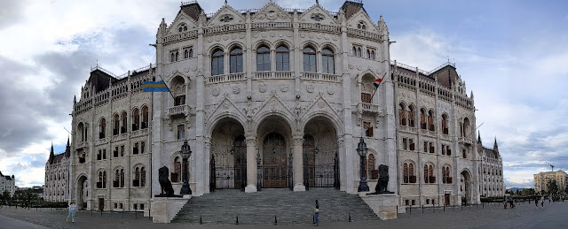

# Hello Dictator
##### By G.dot
_Published on 2022-09-21T21:52:00.002+02:00_

So begrüßte vor Jahren der damalige EU Ratsvorsitzende Jean Claude Juncker den ungarischen Ministerpräsidenten Victor Orban.

Daran musste ich denken, als ich einen halben Tag durch Budapest schlenderte. Eine richtige Großstadt. Irgendwie zu groß für das kleine Völkchen der Ungarn. Allein das Parlamentsgebäude lässt Westminster bescheiden wirken.

Immerhin, dachte ich, weht daran eine ukrainische Fahne. Aber nein, genau besehen (und Google lense befragend) handelt es sich um die Flagge des zu [Rumänien gehörenden Szeklerlands](https://de.wikipedia.org/wiki/Szeklerland). Dort lebt eine ungarische Minderheit.

Man stelle sich vor, am Berliner Reichstag würde die Flagge Ostpreußens gehisst. Unvorstellbar. 

Hoffentlich bleibt Urban _nur_ Dictator und wird nicht auch noch [Revanchist und Aggressor](https://www.nzz.ch/meinung/ukraine-orban-gibt-den-putin-freund-und-stellt-sich-quer-ld.1683887).  Einen deutlichen [Warnschuss](https://www.tagesschau.de/ausland/europa/ungarn-eu-parlament-demokratie-101.html) hat er ja gerade aus Brüssel bekommen.

---
Categories: Kultur,Länder,sonstiges