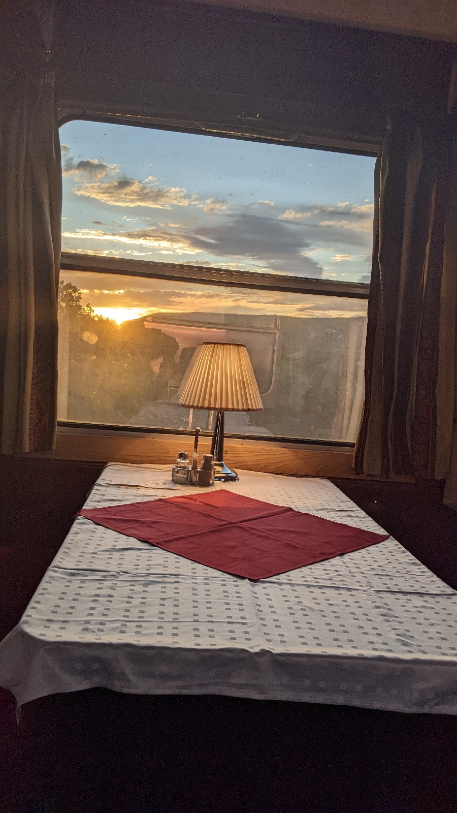

# Nachtzug
##### By G.dot
_Published on 2022-09-23T08:37:00.001+02:00_

Man muss es mögen. Es wackelt, quietscht, ist eng. Meist sind die Wagen in die Jahre gekommen. Fremde Menschen übernachten mit einem im Raum. Grenzbeamte wollen mitten in der Nacht die Ausweise sehen.

Wen das nicht stört, der kann im Schlaf halb Europa durchmessen. 

  

  

Dafür bekommt man, wie hier von Budapest nach Split, im Sonnenaufgang Dalmatiens das Frühstück serviert.

Die Dinge werden aber besser. Nachdem Nachtzüge in den letzten Jahrzehnten im Schatten der Billigflüge keine Chance hatten, besinnen sich viele dieser umweltfreundlichen Form der Fernreise. Österreich ließ [ganz neue Wagen](https://www.nightjet.com/de/komfortkategorien/nightjet-neue-generation) entwickeln. Die deutsche Bahn hatte Nachtzüge 2016 abgeschafft. Sie verläßt sich auf die Nachbarn.

---
Categories: Reise