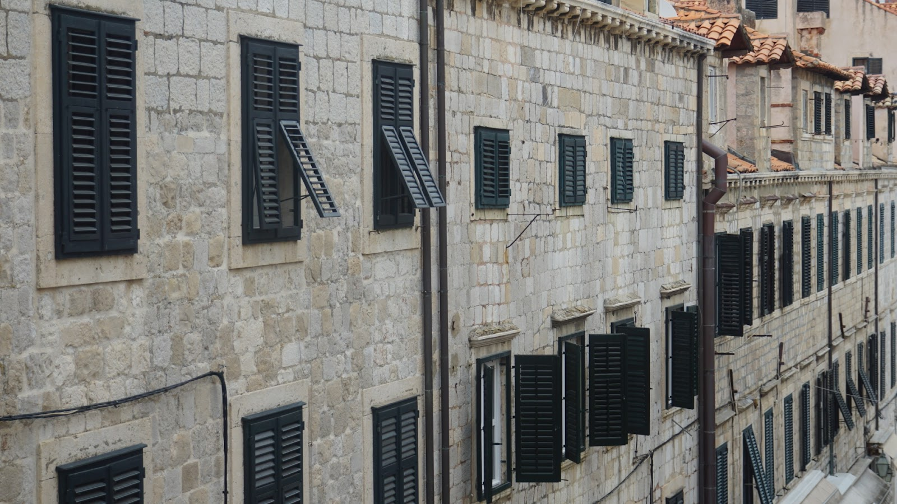
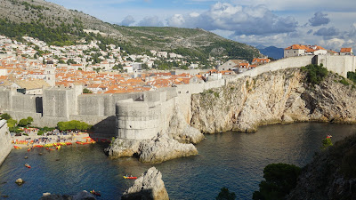
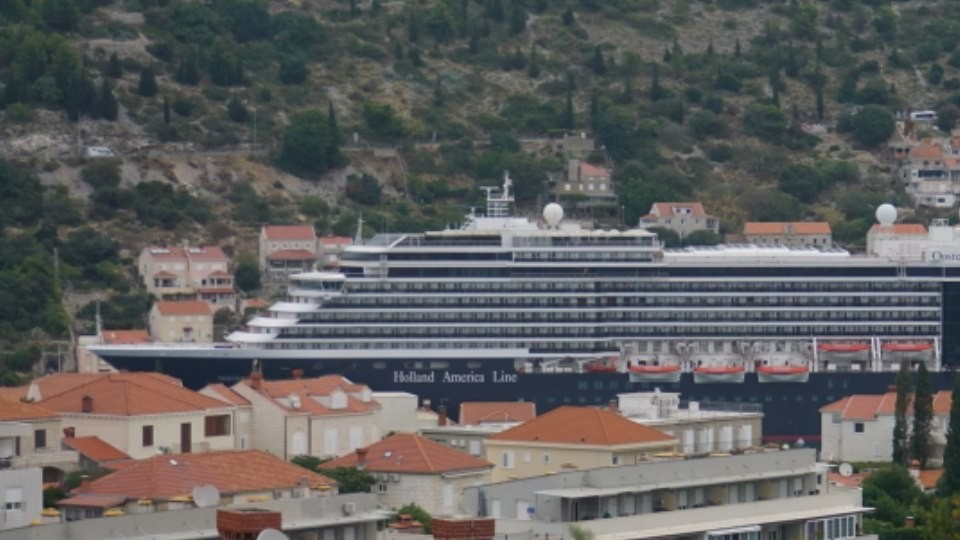

# overrated overtouristed
##### By G.dot
_Published on 2022-09-27T20:41:00.003+02:00_

Dubrovnik: Eine Neubausiedlung des Barock.

Das steht in keinem Reiseführer, aber es ist mein Eindruck von der Stadt. Eine von einer dicken Mauer eingehüllte Altstadt, die von Touristenmassen heimgesucht wird.

Dabei stammen die meisten Bauten aus einem Wiederaufbau nach einem Erdbeben 1667.   

Das Bemühen nach dem Kroatienkrieg, die Zerstörungen im UNESCO-Weltkulturerbe zu beheben, hat sein übriges getan. Klar, es gibt ein paar tolle Bauten in der einst reichen Handelsstadt, die Lage immerhin ist eins A. 

Dubrovnik wird wie quasi alle Küstenstädte von Touristenmassen überrannt. Die gigantischen Kreuzfahrtschiffe rammen sich förmlich in die Orte, kippen ihre Fracht in die Gassen, die dann höchstens einen Kaffee trinken. Gegessen und geschlafen wird ja auf den Schiff. Dazu hängen deren Abgase über den Buchten fest. 

Eine zweite Problemgruppe sind Billigflug-Jugendliche mit fehlender Kinderstube. Chillen am Strand, Party in der Stadt und Kotzen im Park. Dieser Triathlon ist ein Fluch.

  

Doch woanders ist es auch nett und die Kugel Eis kostet nicht drei Euro.

---
Categories: Geschichte,Kultur,Länder