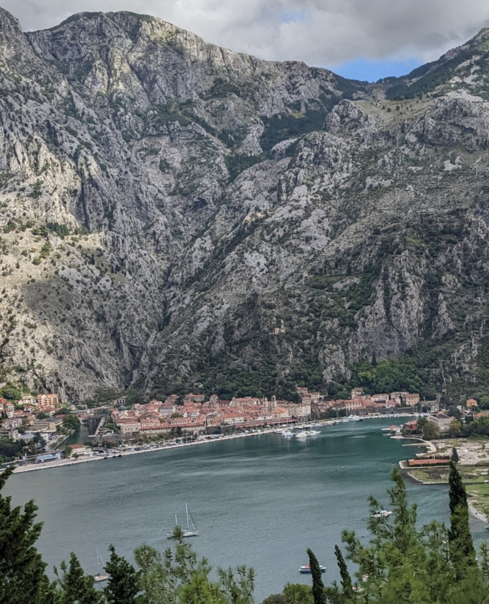
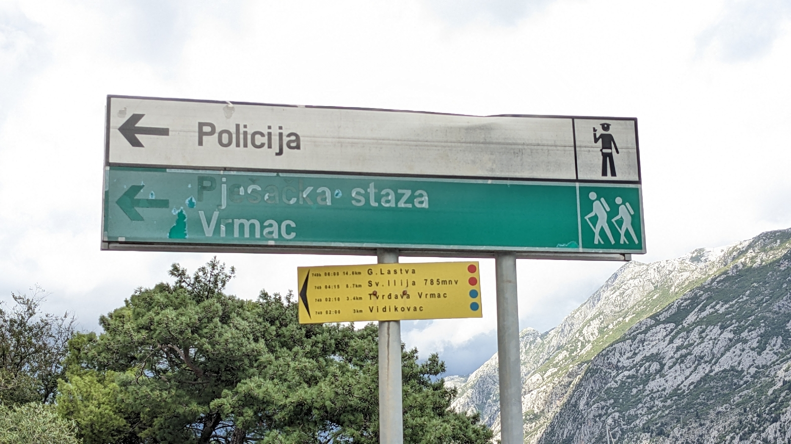
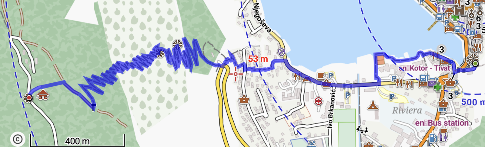

# Wandern in Kotor
##### By G.dot
_Published on 2022-09-29T08:42:00.004+02:00_

Das in einem Fjord versteckte Kotor ist ein drolliges Örtchen. Von hohen Bergen umschlossen, ist es erst seit dem Bau eines Straßentunnels 1991 vom Land im modernen Sinne wirklich erreichbar. Die alten Ochsenwege ins Inland machen heute Wanderungen aus der Stadt heraus leicht. Eine führt gleich außerhalb der Stadtmauer steil hinauf. Die Steigung ist dabei nie übermäßig groß. Die Ochsen mussten es ja schaffen. Nach etwa zweihundert Höhenmetern kann man rechtshaltend die Stadtmauer durch eine Schießscharte regelrecht entern. 

[

Dahinter gibt es die ausgedehnten Verteidigungsanlagen zu besichtigen. Wer mag, kann auch auf dem alten Weg bleiben und weiter ins Gebirge steigen.

([Startpunkt der Wanderung als what3words-Koordinate](https://w3w.co/beschaffen.sachbuch.erstellen))

Die andere Wanderung ist nicht weniger spektakulär. Sie zickzackt sich auf der anderen Seite der Bucht den schroffen Berg hinauf. Die Augen gehen einem über bei den anauernden Insta-story-tauglichen Ausblicken. Eine Kostprobe:

Der [Startpunkt ist das Südtor](https://w3w.co/heimatforscher.uhrmacher.schwester). Dann geht es 500m um die Bucht. An einem Hinweisschild zur Polizei beginnt dann links der Aufstieg.

Es folgen einige versteckte Treppenstufen bevor man den eigentlichen Weg erreicht. Eine gute Karte hilft sehr. Den GPX-Pfad kann ich auf Wunsch gerne bereitstellen.

Der Nettes verheißende Krug auf der Karte entsprach nicht Wahrheit. Da oben ist nur eine Geschützstellung aus den ersten Weltkrieg. Der Ausblick aber ist ein Traum. Auf den Bergrücken kann man auch weiter wandern.

Bitte ausreichend Wasser mitnehmen.

Unterwegs gibt es keinen Nachschub.

---
Categories: Länder