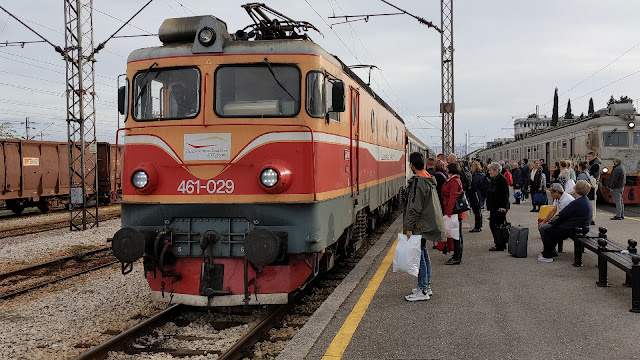
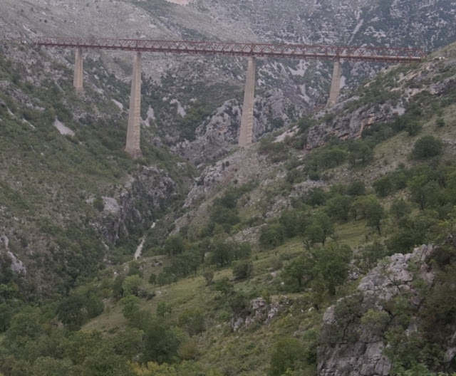
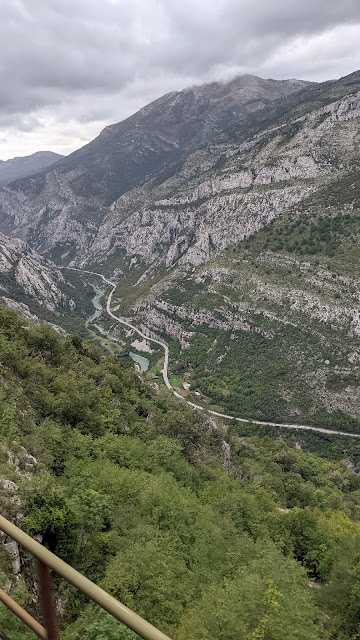

# Pufferksser
##### By G.dot
_Published on 2022-10-01T17:20:00.003+02:00_

Wer dieses Wort nicht kennt: So nennt man etwas despektierlich Leute mit einer großen Zuneigung zur Eisenbahn. Wer zwei Monate Eisenbahn fährt, muss das offenbar nett finden. Dann sucht man natürlich nicht nur nach schönen Zielen, sondern der Schienen-Weg ist das Ziel. Einer dieser besonderen Wege ist die Bahnstrecke von Belgrad zur Adriaküste. Sie war ein Prestigeprojekt Titos und eine enorme Ingenieursleistung. Die nationale Bedeutung war vergleichbar mit dem Bau der BAM oder vielleicht (im Kleinen) "Max braucht Wasser". Die Jugend Jugoslawiens strömte in die Berge, um die Zukunft zu bauen. 

Man überquert bei der Fahrt die höchste Eisenbahnbrücke Europas. Hunderte Tunnel und Brücken machen sie zu einem faszinierenden Erlebnis. Bis heute wird die durch zum Großteil menschenleers Karstgebirge führende Strecke täglich von Streckenläufern überwacht. Ein sehr l[esenswerter Wikipedia-Artikel](https://de.wikipedia.org/wiki/Bahnstrecke_Belgrad%25E2%2580%2593Bar?wprov=sfla1) erzählt ausführlich. Heute hat übrigens China die Strecke als Teil ihrer neuen Seidenstraße entdeckt und hilft tatkräftig bei der Sanierung.

  

---
Categories: Geschichte,Länder,Reise,Technik