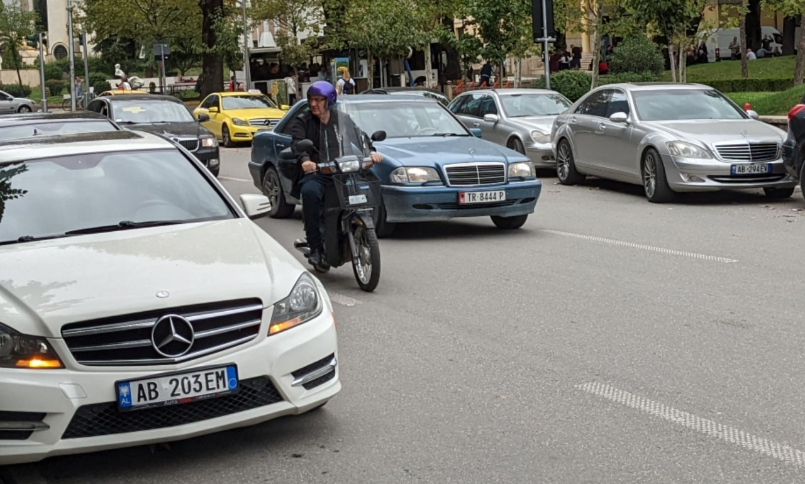
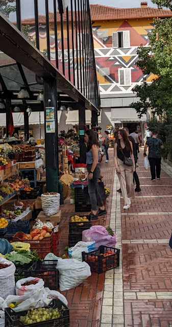
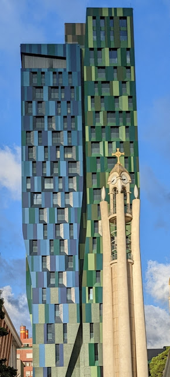

# Mutter Theresa und die Autowsche
##### By G.dot
_Published on 2022-10-04T16:11:00.002+02:00_

Die vielleicht berühmteste Tochter des Landes darf dem Flughafen der Hauptstadt ihren Namen geben. Weithin bekannt dürfte auch Envar Hoxha sein. Gegensätzlicher können Menschen kaum sein. Richtig, von Albanien ist die Rede. Das Jahrzehnte in Steinzeitstalinismus isolierte Land ist mächtig im Aufbruch. Der passiert im Benz und auf den Fahrrad. Ja, in Albanien wird Fahrrad gefahren. Und Mercedes.

  

  

Das Land hat mit die jüngste Bevölkerung in Europa. Die Hauptstadt Tirana ist bunt und sehr lebendig. Und eben voller Fahrradwege, die auch benutzt werden. Selbst auf den Landstraßen sieht man oft mutige Pedalritter, die der südländisch dynamischen Kraftfahrerei trotzen.

  

[

  

Wer auf dem Bild rote chinesische Fahnen sieht, liegt richtig. Dazu später mehr.

Dass ein Aufbruch im eigenen Kraftwagen passiert, ist ja nicht neu. Beachtlich ist die Anzahl der Waschgelegenheiten im Lande. Der Stolz will gepflegt sein. 

In der Hauptstadt wird gewaltig gebaut. Bunte Fassaden sind längst nicht mehr das alleinige Aushängeschild.

  

  

Tradition und Moderne kommen sich hier sehr nahe, wenn die Rufe der Muezzin sich mit dem Donnern der Presslufthämmer mischt.

  

  

Für Reisende ist Albanien ein sehr preiswertes Vergnügen. Die Lebensart in einer Mischung aus Balkan-Style und dem Espresso-Eis-Pizza Dreiklangs der langjährigen Besatzer.

Für Zugfahrende gibt es hier aber leider nichts zu holen. Der ehemalige Hauptbahnhof ist abgerissen. Der Bus ist das Mittel der Wahl. Allerdings ist selbst der Nahverkehr der Hauptstadt ein Rätsel. Es gibt weder Fahrpläne noch brauchbare Infos zu Routen. Durchfragen ist Stand der Technik. Auf eigene Faust das Land zu erkunden ist anstrengend. Entweder am Fahrplan oder (als Selbstfahrer) im üblichen Fahrstil. Trotzdem: Daumen hoch für Albanien. Dicke Empfehlung.

---
Categories: Geschichte,Kultur,Länder