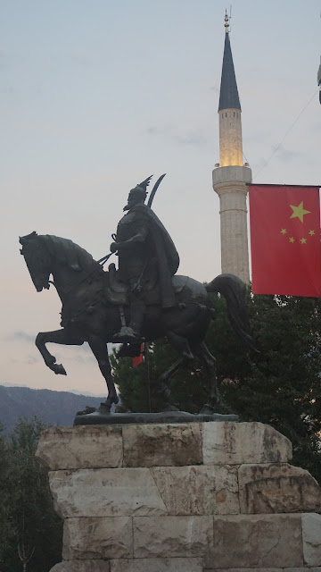
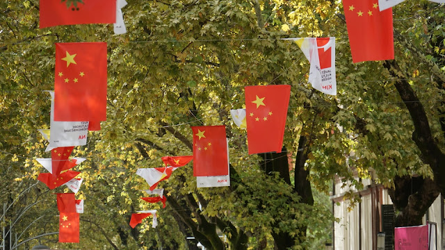
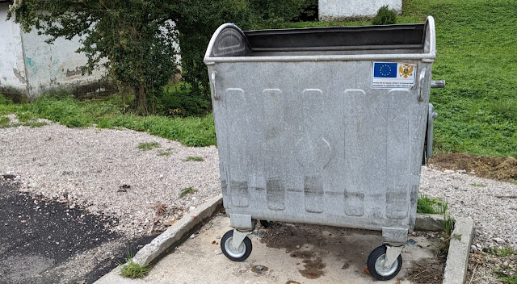

# Baggern
##### By G.dot
_Published on 2022-10-05T15:44:00.001+02:00_

Reist man als mit offenen Augen durch den Balkan, fallen nicht nur die vielen dauerfilmenden Touristen aus China auf, sondern auch behelmte Arbeiter oder tanzende Damen aus dem Reich der Mitte.

  

  

Ganz offensichtlich baggert China kräftig an seiner neuen Seidenstraße auf dem Balkan. Wenn das schon einem Reisenden auffällt, wie viel macht die rote Diktatur dann hinter den Kulissen? 

Das Zentrum Tiranas ist voller chinesischer Fahnen, ein chinesisches Kulturprogramm läuft - mit kostenlosem Essen. Wessen Brot ich ess' dessen Lied ich sing'. Ist es so simpel? Scheinbar.

  

  

Ganz gezielt sind die da an Start, wo Demokratien oder Wirtschaft noch schwach sind. Sie kauften griechische Häfen während der Krise. Helfen bei das Sanierung wichtiger Bahnstrecken in Osteuropa. Dabei kommen sie nicht als Samariter. Über Kredite machen sie klamme Staaten abhängig. Eine [umfassende Recherche](https://interaktiv.tagesspiegel.de/lab/china-der-gefuerchtete-partner/) dazu findet man im Tagesspiegel.

Die EU sollte hier nicht klein beigeben. Zugegeben, es ist ein dickes Brett, westliche Werte als Bedingung schmackhaft zu machen. China schert sich keinen Deut um Menschenrechte oder Sozialstandards. Aber ihnen deshalb das Feld zu überlassen, kann langfristig uns selbst unsere Werte rauben.

  

  

Ein paar Mülltonnen sponsorn (wie hier in den Bergen Montenegros gesehen) und EU-Betrittsversprechen Jahrzehnte zu stecken ist sicher nicht der richtige Weg.

---
Categories: Geschichte,Kultur,Länder