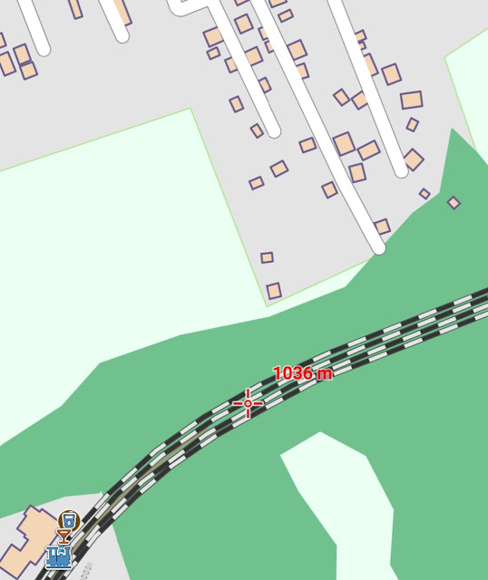
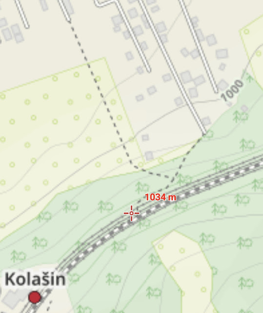

# Mitnetz
##### By G.dot
_Published on 2022-10-07T10:02:00.001+02:00_

Digitale Begleiter sind beim Reisen nicht mehr wegzudenken. Viele der Dienste und Programme, die ich nutze, sind kostenlos. So etwas gibt es in der physischen Welt selten. Kaum jemand verschenkt sind Arbeit oder Dienstleistung. Im Netz sind natürlich die Geschäftsmodelle andere. Google & Co. machen unsere Datenspuren zu Geld. Das ist ok, solange ich weiß, daß sie es tun und ich kontrollieren kann, was sie über mich wissen.

Es gibt aber haufenweise Dienste, die keine Daten abschnorcheln und trotzdem kostenlos sind. Wikipedia, nextcloud, opensteetmap, tasmota, wireguard, öffi - alle gut, nützlich und kostenlos. Wie geht das? Wovon werden die Entwickler bezahlt? 

Nun, es gibt auch da sehr verschiedene Modelle. [Öffi](https://taz.de/App-Programmierer-Andreas-Schildbach/!5030971/) zum Beispiel wird von einem Menschen entwickelt, der das einfach gerne macht und seine Arbeit der Welt schenkt. Altruismus in Reinform. Software wie nextcloud kostet für Unternehmen Geld oder zumindest der Support. Private Nutzung kann dadurch verschenkt werden. Viele andere Projekte wie Wikipedia Leben von Spenden. Aber auch mitmachen ist gerne gesehen. Hat du schon mal was bei Wikipedia geschrieben? Warum nicht? Du kennst dich doch bestimmt bei etwas besonders gut aus. Los, nur Mut! Selten zwar aber ein paar Mal habe ich was in ein Wiki eingetragen oder korrigiert. Oder ich steuere ein Anwendungsbeispiel zu einer Software bei.

Beim Reisen sind natürlich [elektronische Landkarten](https://www.openandromaps.org/) sehr wertvoll. Außerhalb von Mitteleuropa, so lerne ich, sind die aber ziemlich unvollständig. So hat mich in den Bergen Montenegros gewundert, daß es keinen Pfad von den nahen Straßen zum Bahnhof geben soll.

  

  

Die offizielle Zufahrtsstraße ist ein ziemlicher Umweg. Ein Spaziergang am nächsten Tag zeigte, daß es einen gibt. Die Karte kennt ihn nicht. Auch da kann man mitmachen. Sogar für Android gibt es eine [App, um Landkarten zu bearbeiten](https://vespucci.io/). Also habe ich mir die installiert, ein YouTube-Videochen als Einstieg angeschaut. Eine Stunde später gibt es denn Pfad.

  

  

Alle, die wie ich ahnungslos dort aus dem Zug stolpern, können nun auch die Abkürzung in den Ort nehmen.

Wer sich nicht berufen fühlt, öffentliche Daten zu bearbeiten, sollte zumindest in Betracht ziehen, an die freien Projekte zu spenden. Dort wird jeder Cent gebraucht, um Server, Entwicklung und Wartung zu finanzieren.

Auch eine App zu kaufen ist ein guter Weg. Viele Anwendungen lassen sich für sehr wenig Geld von Werbung befreien. Das hilft dem Programmierer und schont deine Augen.

  

\[Die Karten-App meiner Wahl nennt sich locus, kein Witz. Die gibt es kostenlos oder mit erheblich größerem Funktionsumfang im Abo. Alternativ bietet sich OSMand als Open source an. Beide brauchen keine Internetverbindung, um Karten zeigen zu können. Etwas Einarbeitung in die Bedingung so einer Anwendung ist aber nötig. Beides ist übrigens für Android. Für iOS kenne ich nichts vergleichbares.\]

---
Categories: Planung,Reise,Technik