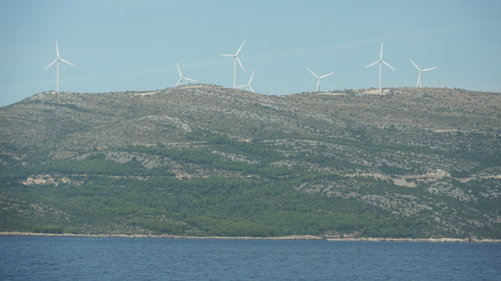

# Von Jgern und Sammlern
##### By G.dot
_Published on 2022-10-09T10:26:00.001+02:00_

Vorbemerkung: Das ist ein längerer Text, der nur wenig mit meiner Reise zu tun hat. Die bietet aber Anlass und Gelegenheit, ihn zu schreiben. 

  

"Treibe Sport!", "Iss viel Gemüse!", "Trinke weniger Alkohol!" - die und noch viele andere Ratschläge bekommt man, wenn man danach fragt, wie man gesund leben sollte. Warum? Warum muss man sich überhaupt diese Frage stellen? Kein anderes Lebewesen zieht in Betracht sein Lebenswandel zu ändern, um gesünder zu sein. Wahrscheinlich leben sie einfach richtig.

Eine Antwort kann lauten: Unser Körper und unser Geist passen nicht zu unserem Lebenswandel. Schaut man sich evolutionäre Veränderungen an, so vollziehen sie sich über Äonen. Deshalb glaubten frühere Kulturen an eine statisch geschaffene Welt. Unser Horizont reicht einfach nicht aus, evolutionäre Prozesse zu erkennen. Erst unser Intellekt erlaubt es, diese Zusammenhänge zu erkennen.

Die Biologie lässt sich Zeit. Wir sind keine Homo Autobilensis, keine Homo Großstadtensis. Wir sind biologisch nach wie vor höchstens Jäger und Sammler. Das haben wir Jahrtausende gemacht. Dazu passen perfekt die eingangs erwähnten modernen Gesundheitstips. "Lebe wie eine Jäger und Sammler!" ließen sie sich zusammenfassen.

Versteht man erst einmal diese Diskrepanz, ergeben sich Antworten auf viele aktuelle Fragen. Ein heute so genanntes Vorurteil ist, zum Beispiel, für den Jäger die in Sekundenbruchteilen zu fällende Entscheidung, ob er im Busch Freund oder Feind gegenüber steht. Auch mußte er seine Umgebung in seiner Lebensspanne gut kennen. Welche Auswirkungen sein Holzfällen und Verbrennen aus den Meeresspiegel hat, war unwichtig.

Wir sind also gemacht für das Verstehen unmittelbarer Ursache-Wirkung Bezüge. Das Begreifen langfristiger Zusammenhänge ist in unserer Biologie nicht vorhanden. Es war schlicht nicht nötig für Erfolg.

Unser großes Hirn ist nun aber Fluch und Segen zugleich. Es ermöglicht uns, in - verglichen mit anderen Lebewesen - umfassendem Überfluss zu leben. Es lässt aber auch zu, die langfristigen Folgen unseres Handelns zu erkennen... wenn wir uns bemühen.

Manche vergleichen die Menschheit mit einem Parasiten, der die Erde befallen hat. Übliche Parasiten sind doof und bringen ihren Wirt um und gehen damit selbst drauf. Das klappt, weil es genug Wirte gibt. Wir haben nur eine Erde. Wenn wir diesen Wirt zugrunde richten, sind wir auch am Ende. Übrigens: Das Bewahren der Erde sollte nicht Umweltschutz heißen. Die Umwelt wird uns lächelnd überleben. Es ist viel mehr der Schutz unserer Existenz, unserer Zivilisation. Menschheitsschutz wäre wohl ein geeigneterer Begriff.

Wozu erzähle ich das? Zu Hause wie unterwegs erlebe ich, wie wir offenbar außer Stande sind, die Folgen unseres Handelns zu verstehen. Wie oben erklärt, erschließt sich vieles nur Intellektuell. Unmittelbarer sieht, schmeckt und riecht man Klimawandel nicht. Warum man durch Handy mit anderen Menschen sprechen kann, versteht (fast) niemand wirklich. Wir Jäger und Sammler begreifen (auch im Wortsinn) das Unmittelbare, nicht das Langfristige, Ferne.

Verschärfend hinzu kommt, daß jeder für sich gute Gründe findet, die möglicherweise verstandenen langfristigen Folgen seines Handelns zu entschuldigen. "Die Anderen machen es doch auch." "Mein Handeln ändert doch nichts an großen ganzen." "Das ist aber zu umständlich." [NIMBY](https://de.wikipedia.org/wiki/NIMBY) ist eine dazu passende Wortschöpfung. Das ist unsere Urmenschenbiologie. Die kulturell gelernte Überformung reicht nicht, um unser Handeln fundamental zu beeinflussen. Und wir sind zu dumm. Der Busfahrer lässt beim Parken den Motor laufen. Er zahlt den Sprit ja nicht. Das Thermostat steht auf 5. Der Besitzer weiß nicht, was eine Regelung ist. Der Büromensch "lüftet" weil er glaubt, kalte Luft sei frischer als die vorgewärmte aus der Lüftungsanlage.

Was tun?

Aus den schrecklich schiefgegangenen Gesellschaftsexperimenten des vergangenen Jahrhunderts haben wir gelernt, daß sich der gute Mensch nicht züchten lässt. "Jeder nach seinen Fähigkeiten, jedem nach seinen Bedürfnissen." ist eine Illusion. ([Ref](https://de.wikipedia.org/wiki/Sozialistisches_Leistungsprinzip).) Gutes nachhaltiges Handeln ist Ehrenwert, wird aber die Welt nicht retten. Umerziehung ist keine Option. Was funktioniert dann? Markt und Regeln. Gesetze regeln erfolgreich unser Zusammenleben. Manche Politiker diffamieren Regeln als Verbote. Der facto sind Gesetze Verbotssammlungen. Es ist sogar alles erlaubt, was nicht per Gesetz verboten ist. Das erst ermöglicht ein friedvolles Miteinander. 

Es ist verboten, bei Rot über die Kreuzung zu fahren. Es ist verboten, jemandem etwas wegzunehmen. Es ist verboten, einfach im Wald einen Baum zu fällen. Erst diese vereinbarten Verbote ermöglichen Freiheit miteinander.

Das andere, was funktioniert, ist der Markt. Messe etwas einen Wert bei und es wird sich ein Markt bilden. Um unsere Erde zu schützen müssen wir ihren Ressourcen einen Wert zumessen. Ein [CO2-Zerifikat](https://de.wikipedia.org/wiki/CO2-Preis) ist ein gutes Werkzeug. Nur muss es teuer genug sein, was es aktuell nach Ansicht vieler Experten nicht ist. Du willst ein Kernkraftwerk betreiben? Gerne. Aber versichere es auch. Geht nicht. Keine Versicherung gegen die Folgen eines Unfalls wäre wirschaftlich. Und das Endlager bezahlst du auch! Schon ist Kernkraft vom Markt.

Die kluge Verknüpfung von durch Verbote eingehegtem Markt ist ein Weg, den Jäger und Sammler verstehen können. Dabei müssen irreversible Eingriffe durch Verbote verhindert werden. So ist ein gerodeter Regenwald auf sehr lange Zeit verloren. Da dürften nur einzelne Bäume geerntet werden. Übrigens, schon in der [Bronzezeit](https://de.wikipedia.org/wiki/Burren) haben Menschen die Umwelt kaputt gemacht. 

  

Soweit die heere Theorie. Die Wirklichkeit ist leider viel komplizierter. Staaten, Unternehmen, Lobbyisten haben eigene Agenden. Zusammen mit dem unterschiedlichen Entwicklungsständen der Länder ergibt sich große Blockaden. Warum auch sollten andere Länder ihre Urwälder nicht roden? Wir, die Europäer haben es auch gemacht. Vor Jahrhunderten. Und mit dem daraus gebauten Schiffen haben wird dann die Welt unterjocht. Aber das ist ein anderes Thema.

Große Wirtschaftsräume wie die EU können aber zum Beispiel importiere CO2-Ausstöße besteuern. Das wird auch gemacht und geht gut bei Kohle oder Stahl. Aber wie viel CO2-Ausstoß steckt in einem Handy, importiert aus China? Es ist kompliziert.

Ein Ansatz, etwas Vergleichbarkeit oder Gerechtigkeit einzuführen ist die Idee des [CO2-Gesamtbudgets](https://de.wikipedia.org/wiki/CO2-Budget). Dabei werden alle historischen Emmisionen eines Landes addiert. Der fette Westen hat danach schon einen Großteil seines Budgets verbraucht. Nach diesem Maß müssten diese Länder bei der Decarbonisierung ihrer Gesellschaft voran gehen. Die können das auch technologisch wie wirtschaftlich. Deutschland zum Beispiel müsste danach 2030 bei Null sein. Bei aktueller Politik ist das leider illusorisch. 

  

Bei meiner Reise durch Europa habe ich leider einen sehr ernüchternden Eindruck gewonnen. Südeuropa ist gesegnet mit Sonne. Auch Wind gibt es ab dem Küsten und in den Gebirgen reichlich. Beides liegt brach. Windräder haben Seltenheitswert. Solarmodule sieht man so gut wie nirgends. Dabei hat beispielsweise Sizilien fünfzig Prozent mehr Sonne als Deutschland. Konventionelle Energie ist ganz offensichtlich noch zu billig. So billig, daß es wirtschaftlich egal ist, ob der Busfahrer den Motor abstellt. Der Markt richtet es nicht. Also brauchen wir Regeln und Gesetze, die auch durchgesetzt werden.

Und was ist mit dem importierten Handy? Ahnlich zum Lieferkettengesetz könnte man die Importeure verpflichten, ein CO2-Budget ihrer Waren anzugeben. Dem kann man dann ein Preisschild umhängen. Ein wünschenswerter Nebeneffekt teurer Energie ist übrigens, daß regionale Produkte und Dienstleistungen relativ günstiger werden. Dann kann vielleicht der Apfel aus Borthen wieder mit dem aus Neuseeland preislich mithalten.

Windräder in Kroatien - ein seltener Anblick

---
Categories: Geschichte,Kultur,sonstiges