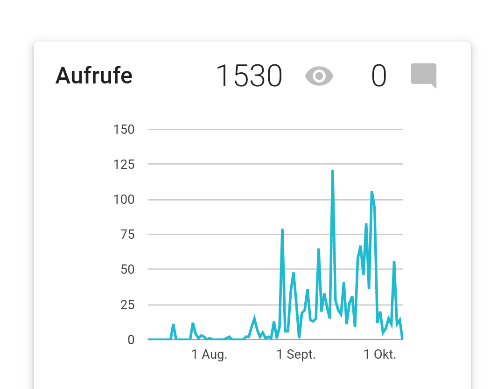
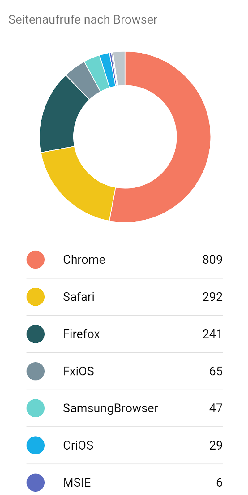
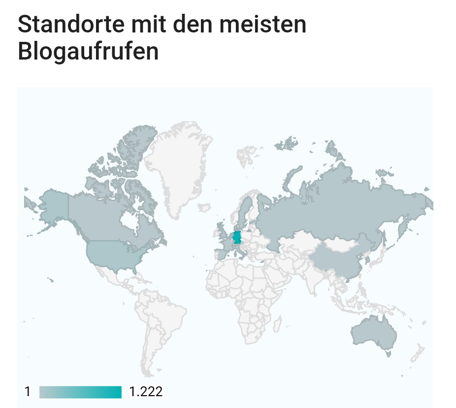
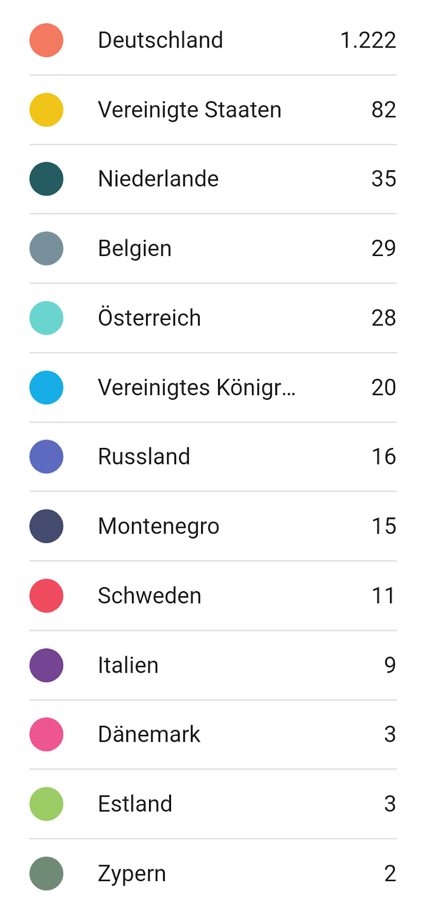

# Was ich ber euch wei
##### By G.dot
_Published on 2022-10-10T14:30:00.001+02:00_

Der Dienst blogger.com, den ich für den Blog nutze, stellt ein paar Statistiken zur Nutzung bereit. Wie diese aussieht möchte ich euch nicht vorenthalten.

  

Offenbar ist die Häufigkeit der Aufrufe sehr zurückhaltend. Maximal gut 100 Besuche pro Tag versprechen noch nicht großes Inflänzen. Da die Seite aber im Internet nirgends verlinkt ist, wird sie im Google-Ranking nicht nach oben schwimmen. 

(Meine Seite hohetour.de war mal auf der Seite der MDR-Sendung Biwak verlinkt. Das fand Google toll und sie wurde findbar.)

  

  

Hier plaudert euer Endgerät den benutzten Browser aus. Sogar der Saurier Internet Explorer kommt noch vor.

  

  

Spannen finde ich, aus welchem Ländern Aufrufe kommen. Zwar weiß der Dienst nur die Abfragequelle. Wenn also jemand ein VPN nutzt bleibt der echte Ort geheim, aber eine gewisse Statistik ergibt sich schon. Es dominiert natürlich Deutschland, aber es kommen auch viele andere Teile der Welt vor.

---
Categories: sonstiges,Technik