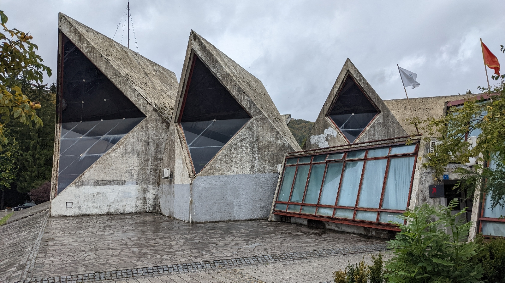
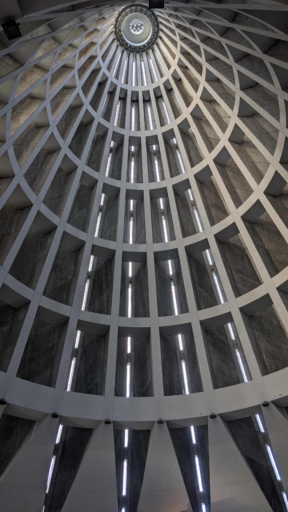

# bton brut
##### By G.dot
_Published on 2022-10-12T19:37:00.001+02:00_

Manchmal hat die deutsche Sprache Wortfindungsstörungen. Wie kann man beispielsweise etwas so nettes, das im Englischen _nipple_ heißt, Brustwarze nennen? Iii. So ein Fehlgriff gab es auch in der Architektur. Aus _béton brut_ im Französischen wurde nicht etwa "roher Beton" oder "sichtbarer Beton" sondern Brutalismus. Die kollektive Wortfindung hat versagt. Die graue Erscheinung rohen Betons wird abgestempelt als brutal. Und man glaube es, den die Entwürfe sind oft wenig elegant. 

Unterwegs sehe ich einige Beispiele dieses mutigen Aufbruchs der Architektur. Im ehemaligen Jugoslawien hab es offenbar Grüßen Bedarf an repräsentativen Bauten.

  

  

An vielen nagt der Zahn der Zeit unterstützt von einem Mangel an Zuwendung, wie hier an Rathaus von Kolasin.

Aber es gibt auch selbstbewusste Bauten, die gut in Schuss sind. So die Wallfahrtskirche in Syracuse auf Sizilien.

  

---
Categories: Kultur,sonstiges