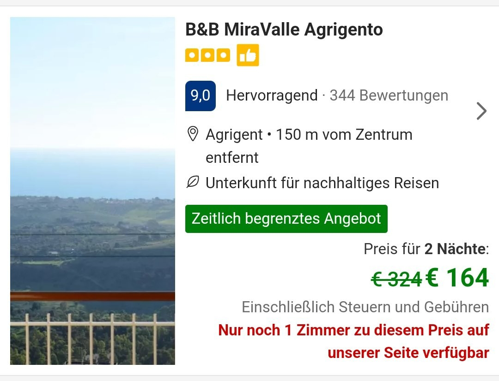
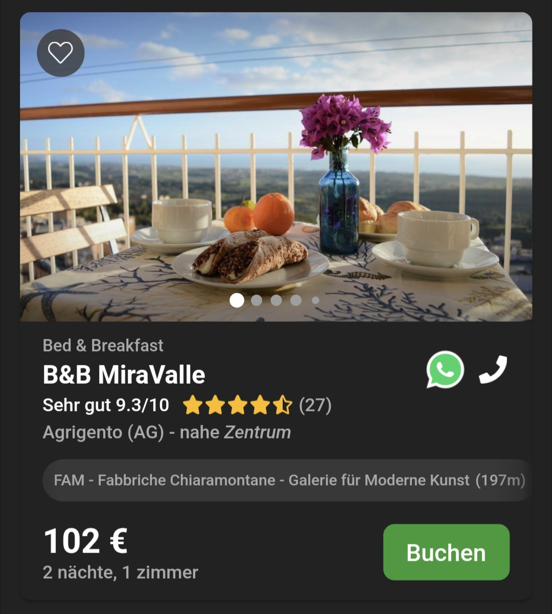

# Partisanen der Netze
##### By G.dot
_Published on 2022-10-14T08:06:00.001+02:00_

Das Netz der Netze bringt es mit sich, daß die Großen größer werden weil sie groß sind. Wer die beste Datensammlung hat gewinnt. Weil die beste Sammlung auch für den Nutzer am nützlichsten ist und meist kostenlos, gibt es kaum einen Grund, sie nicht zu nutzen. Ein Teufelskreis, der Macht und Größe belohnt. Wird ein Konkurrent gefährlich, kauft man ihn auf. Macht bedeutet auch Geld.

Suchen, Kommunizieren, Kaufen - viele Bereiche im Netz sind wie von Oligopolen besetzt. Es gibt wenige Große, die sich den Markt aufteilen.

Ein Beispiel, das auf meinen Reisen wichtig ist, ist Unterkünfte buchen. Airbnb und booking.com sind hier Platzhirsche. Zufällig zeigte mir im vergangenen Sommerurlaub meine Vermieterin ihre Abrechnung der Ferienwohnung mit Airbnb. Die bekam kaum mehr als die Hälfte des von mir gezahlten Preises. Genau 46% steckte sich Airbnb ein. Ob booking.com weniger nimmt, ist mir mir nicht bekannt. Ich habe aber Indizien dafür. In Italien gibt es für Quartiere eine alternative: bed-and-breakfast.it 

Dort zum Beispiel dann ich ein und dasselbe Zimmer mehr als ein Drittel günstig als bei booking.com:

  

Offenbar langt also auch der Zimmer-Vermittler aus Holland kräftig zu. Sicherlich gibt es in anderen Ländern auch Alternativen. Leider fand ich aber oft nur lokale Tourismusverbände. Wechselt man häufig den Ort, ist das mühsam.

  

Insider Tipp: Den global player kann man auch global entgegnen. Netflix & Co. verlangen je nach Land sehr unterschiedliche Preise. So kann man eben virtuell in einem günstigen Land einkaufen gehen.

---
Categories: 