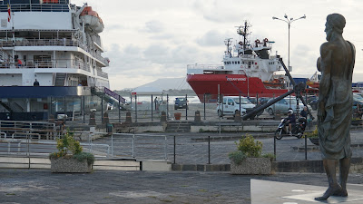
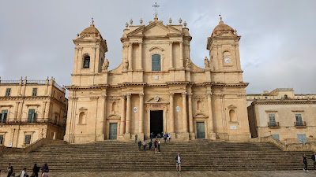
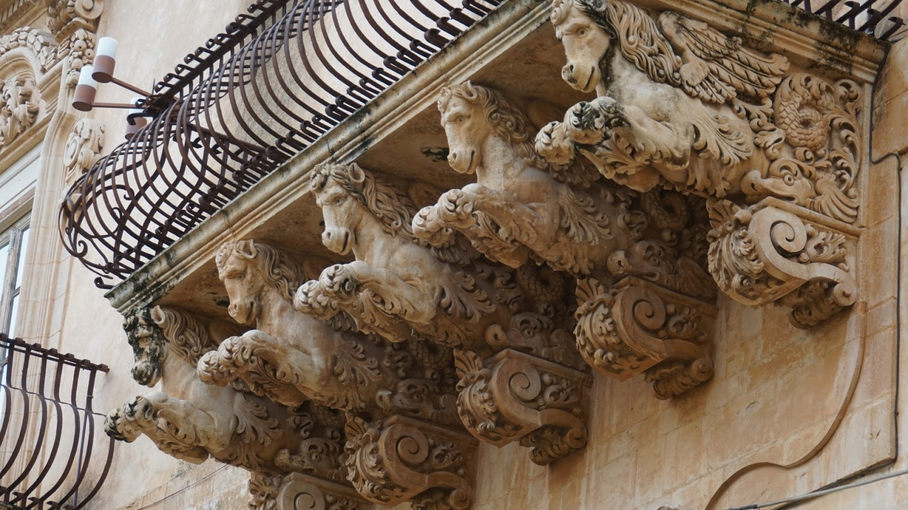

# South of Africa
##### By G.dot
_Published on 2022-10-14T16:28:00.000+02:00_

Mein wohl südlichster Ort meiner Reise ist erreicht. Er heißt Noto und liegt im Süden Siziliens und damit südlicher als Tunis. Daß man nicht weit von Afrika entfernt ist, merkt man aber nur bei genauem Hinschauen.

  

  

Die Ocean Viking wird von Ärzte ohne Grenzen zur Seenotrettung im Mittelmeer eingesetzt und liegt hier gerade neben einem Kreuzfahrtschiff in Syracuse. Archimedes guckt sich das erstaunt an.

  

Kurios ist das Barockdorf Noto und seine Nachbarn. Nach einem verheerenden Erdbeben 1693 baute man die Orte im Stil der Zeit wieder auf. Sehenswert.

  

  

War das [barocke Dubrovnik](https://www.spurtr.eu/2022/09/overrated-overtouristed.html) noch enttäuschender Einheitsbrei, so erstaunt die Kreativität sizilianischer Architekten.

  

Ich wünschte, wir würden unsere Städte auch so selbstbewusst bauen, wie die Menschen vergangener Epochen. Die haben selbstverständlich das neueste und modernste umgesetz, was ging. Wir dagegen bauen Pflaster wieder ein, weil es anno dazumal so war. Ganz offenbar fehlt es uns an Selbstbewusstsein. Wie hätten die Barockarchitekten wohl entschieden, hätten ihnen unsere Technologien und Werkstoffe zur Verfügung gestanden?

---
Categories: Geschichte,Kultur,Länder