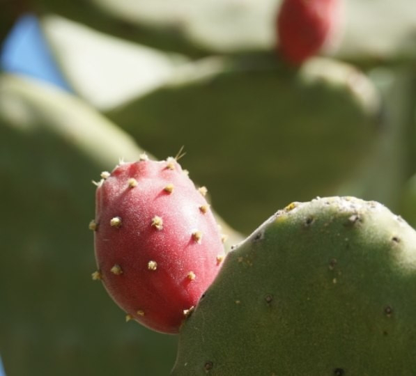
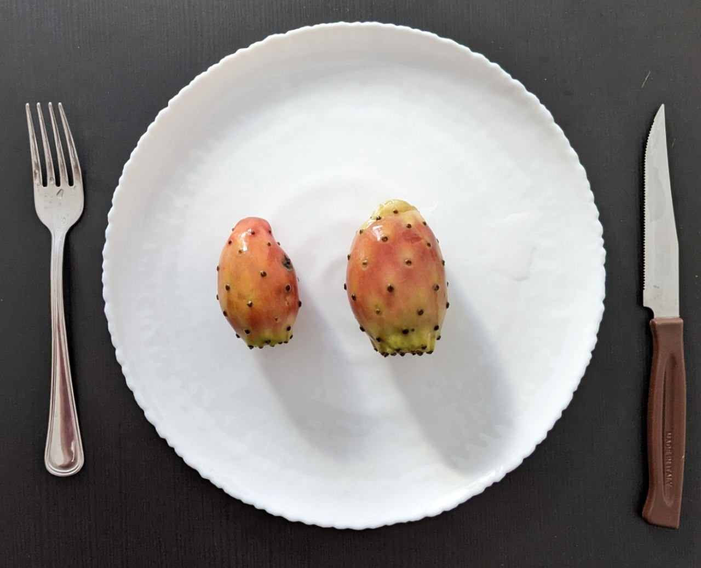

# Der Widerspenstigen Schlung
##### By G.dot
_Published on 2022-10-19T18:00:00.000+02:00_

Als gelernter Ossi fremdle ich bis heute mit mancher Südfrucht. Was der deutsche Discounter importiert kenne ich. Doch was im echten Süden vor mir am Baum hängt, muss ich oft erst googeln. Und selbst wenn ich weiß, was es ist, ist mir noch lange nicht klar, wie man es isst.

Orangen vom Baum pflücken, Guaven naschen - kein Problem. Aber wie nähert man sich dieser im Überfluss wachsenden Frucht?

  

  
Der Feigenkaktus wächst in Süditalien wie Unkraut und lockt mit schönen aber stacheligen Früchten. Auch hier hilft dem ahnungslosen das Netz. Ernten kann man sie bewehrt mit einer die Hand schützenden Plastiktüte. Die Enden abschneiden, mit Gabel festhalten und längs schneiden und schälen. So kommt man an den leckeren Vitamin-C-Schub im Inneren.  

  

  

Ganz ohne Stachel in der Hand habe ich es nicht geschafft, aber ich lerne...

---
Categories: sonstiges