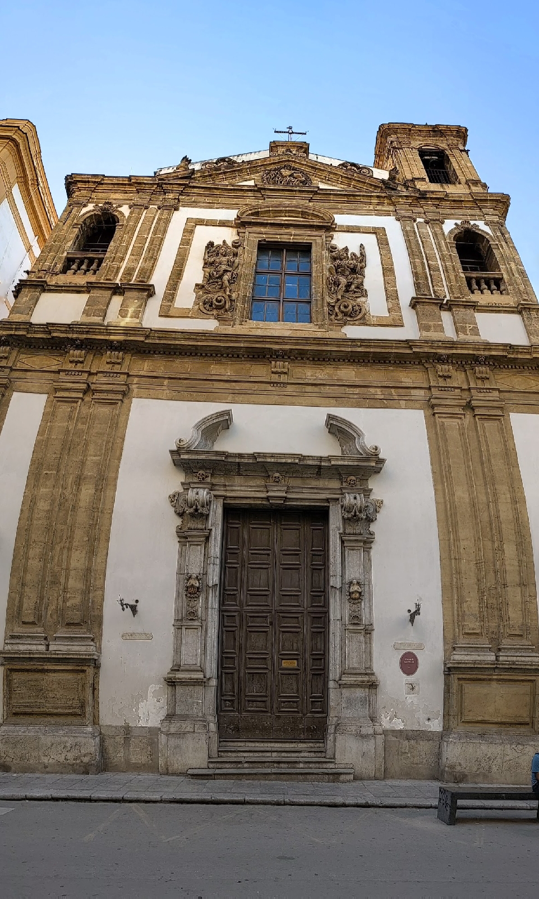
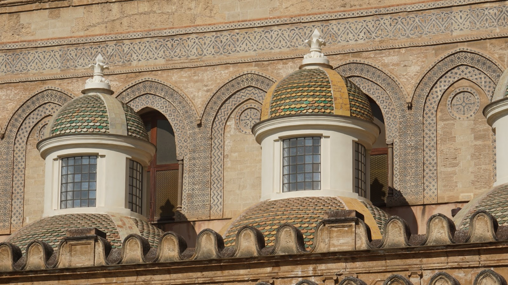

# f16
##### By G.dot
_Published on 2022-10-19T11:00:00.000+02:00_

Hat man _Der Pate_ gesehen, flößt einem der Name der Stadt schon etwas Respekt ein. Palermo. 

Der erste Eindruck wenn einen der Zug in die Innenstadt spuckt passt. Laut, absurder Straßenverkehr, Hitze, Dreck und Prunk. Darauf sollte man sich einlassen, sonst ist man hier falsch. Die Enge und Hektik der Stadt gibt selbst den beeindruckendsten Bauten kaum Platz. Die Brennweite meines Objektivs ist nie klein genug.

  

  

Finstere Gassen führen zu Meisterwerken Arabo-Normannischer Stilhochzeit. 

  

  

Wenige Meter vom zentralen Platz der Stadt sind Paläste den Verfall preisgegeben. Und die Straßenparty geht bis in die Morgenstunden. An Schlaf ohne Ohropax ist nicht zu denken.

---
Categories: Kultur,Länder