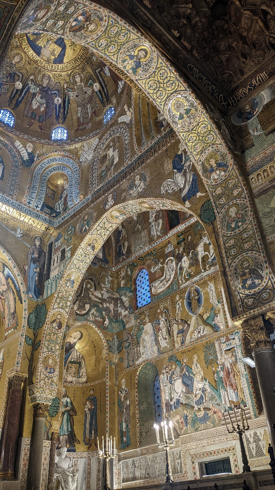

# Die Macht der Erzhlung
##### By G.dot
_Published on 2022-10-20T12:03:00.001+02:00_

Reist man durch die Welt, sind ein Großteil der sehenswerten Gebäude Kirchen und Paläste. Die Herrscher der Vergangenheit hatten das Geld und die Macht, sich die Zeiten überdauernde Häuser bauen zu lassen.

  

  

Ein herausragendes Beispiel ist die Kapelle des Normannenkönigs in Palermo. Goldintarsien überall. Das beeindruckt. Wie sehr müssen majestätische Kirchen erst vor Jahrhunderten auf einfache Leute gewirkt haben, die zum Wohnen eine Kate hatten. Und am Sonntag hat der Pfarrer ihnen erklärt, daß das Gottes Wille sei. Der König darf bestimmen und in Prunk leben, weil Gott das so will. Die Macht der Erzählung wirkt.

Jetzt mag ein Atheist überlegen lächelnd sagen, er glaube ja solchen Geschichten nicht. Ich wette, jeder Mensch glaubt. Kostprobe gefällig? 

Was ist Geld? Bunte Münzen und bedruckte Zettel. Du glaubst an den Wert. Nur weil viele das glauben, wird ihm überhaupt ein Wert zugemessen.

Dein Land. Zeige mir mal dein Land! Es ist vielleicht als bedruckte Seite in einem Atlas abgebildet. Vielleicht hast jemand einen Grenzstein eingegraben. Echt ist nur der Stein und die Druckertinte auf Papier. Das Land ist eine Geschichte.

Noch einer?

Gesetze. Wie das letzte Beispiel sind die nichts als Druckerschwärze auf Papier. Erst weil viele danach handeln, werden die eine Art Wirklichkeit.

Erzählungen, man kann auch Geschichten, Vereinbarung oder Religion dazu sagen, sind sehr machtvolle Gedanken einer großen Gruppe. Die lassen uns Kirchen bauen, Kriege führen und Bankkonten eröffnen. Eigentlich sind die der Trick, um in großen Gemeinschaften zu leben. 

Ich bevorzuge das [Grundgesetz](https://www.gesetze-im-internet.de/gg/index.html) und die [Schlussakte von Helsinki](https://www.osce.org/de/mc/39503) als gemeinsame Erzählungen. Daß der liebe Gott bestimmt hat, daß einer König ist und der Rest bitte auf das Jenseits warten soll, mag Jahrtausende funktioniert haben. Jetzt haben wir besseres. Entsprechend sollten wir die historischen Bauten einordnen. Der eine lebte in gigantischem Wohlstand und ließ diese Paläste bauen während die große Masse dafür buckelte und in übler Armut vegetierte.

Eine Erzählung, der ich Erfolg wünsche, ist die der europäischen Union. Die Idee von Verständigung in diesem von Kriegen geformten Kontinent verdient, eine mächtige Geschichte zu werden. Wir sollten ihr Kathedralen bauen.

  

Das Konzept der mächtigen Erzählung entwickelte übrigens der israelische Historiker Yuval Noah Harari. Sein Buch _Eine kurze Geschichte der Menschheit_ sei jedem Interessieren empfohlen.

---
Categories: Geschichte,Kultur