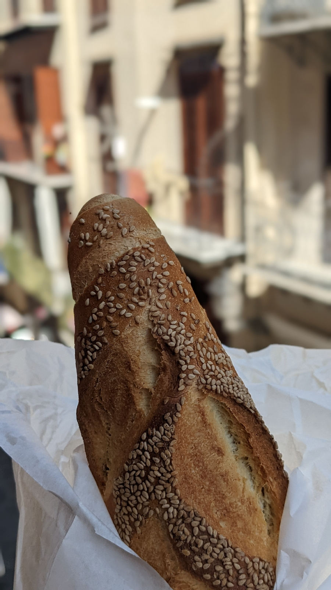

# Brotentwicklungslnder
##### By G.dot
_Published on 2022-10-21T18:18:00.001+02:00_

Was vermisst man an der Heimat, wenn man länger weg ist. Für mich sind das vor allem Brot und Wald.

Erstes ist außerhalb des deutschen Sprachraums nie wirklich über ein gewisses Anfängerstadium hinausgekommen. Ja, ein frisches Baguette ist lecker, aber ein gutes dunkles Brot besser. Nicht ohne Grund ist dass [deutsche Brot ein Kulturgut von Weltrang](https://www.unesco.de/kultur-und-natur/immaterielles-kulturerbe/immaterielles-kulturerbe-deutschland/deutsche-brotkultur).

  

  

Ganz praktisch und aktuell kann übrigens jeder mit helfen, dieses Kulturgut zu erhalten. Geht zum Bäcker statt Discounter für das tägliche Brot!

  

Südlich der Alpen ist außerdem Wald Mangelware. Angeblich haben die Seefahrernationen und -städte quasi ganz Südeuropa für ihre Schiffe abgeholzt. Allein in Montenegro gibt es noch dichte Urwälder. Da sieht man, welche Natur Südeuropa verloren gegangen ist. Mediterrane Ansammlungen von dornigen Büschen und Bäumchen gehen nach meiner Vorstellung nicht als Wald durch.

  

Da freue ich mich schon auf einen Spaziergang durch die Heide im November bei vier Grad über Null und Nieselregen;-)

---
Categories: Kultur,Länder