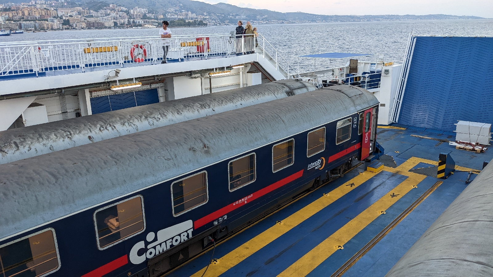
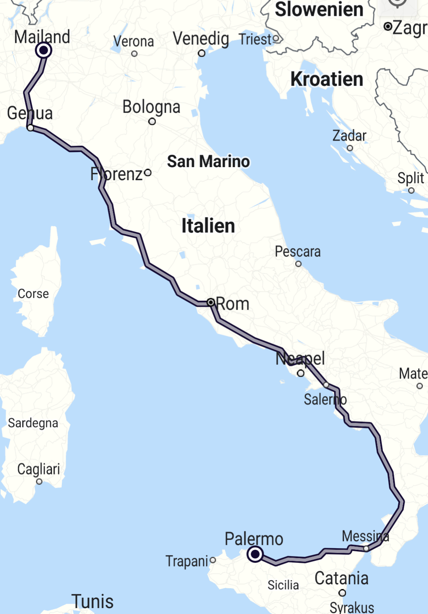

# 887 Kilometer Nacht
##### By G.dot
_Published on 2022-10-22T11:45:00.001+02:00_

Der Rückreise nach Norden beginnt. Der Nachtzug, der eingebrochen Ganztageszug heißen sollte, lädt mich mittags in Palermo ein, in ihm ganz Italien zu durchmessen. Kurios ist, daß der ganze Zug auf einer Fähre durch die Straße von Messina schwimmt.

  

  

Danach ist leider nur noch Nacht. 

Trotz Ruckeln des Zuges und Schnarchen meines Mitabteilers steige ich ziemlich ausgeschlafen in La Spezia aus. Mein Ziel heißt _Chinque Terre_. Das ist eine Kette von wagemutig auf Felsen getupfter Dörfer, die man durchwandern kann.

  

  

(Der Zugverlauf vom Ball bis zum Schienenbein.)

---
Categories: Reise