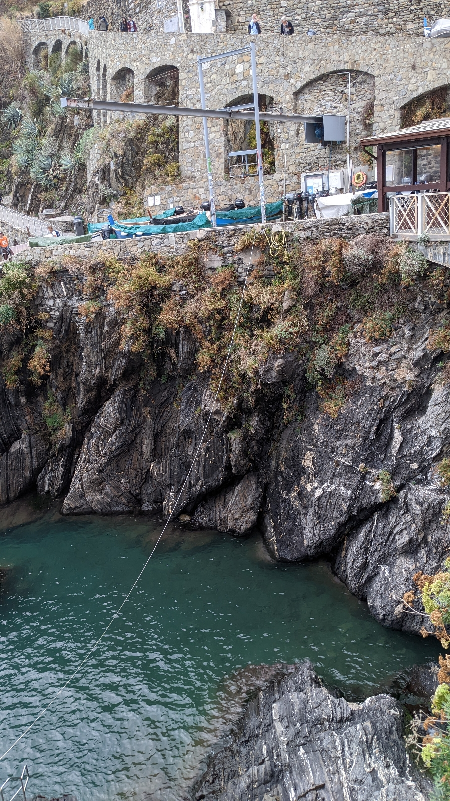
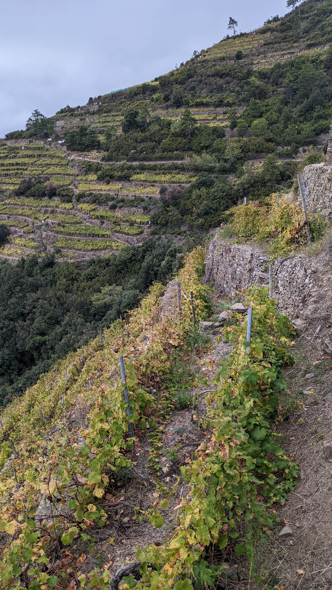
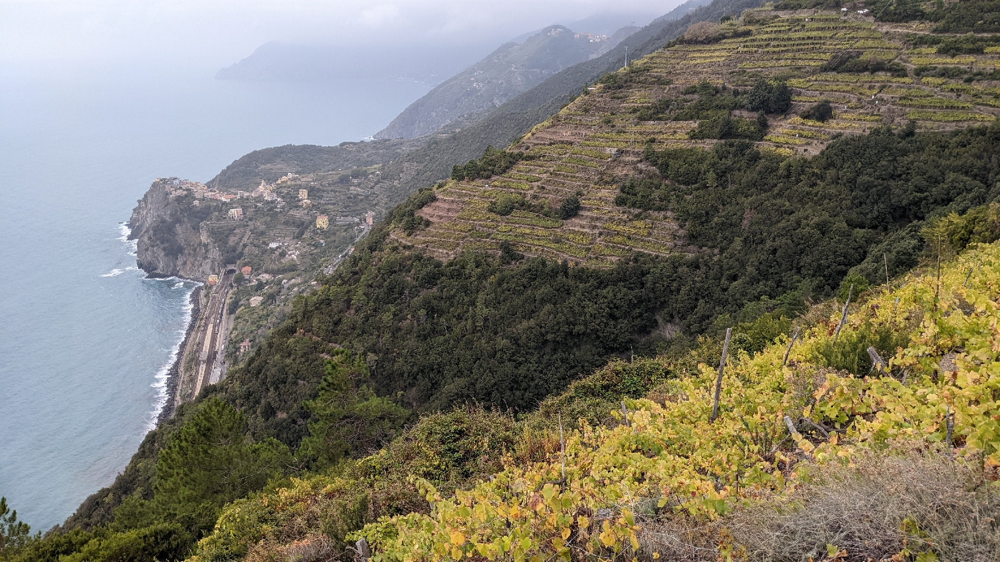
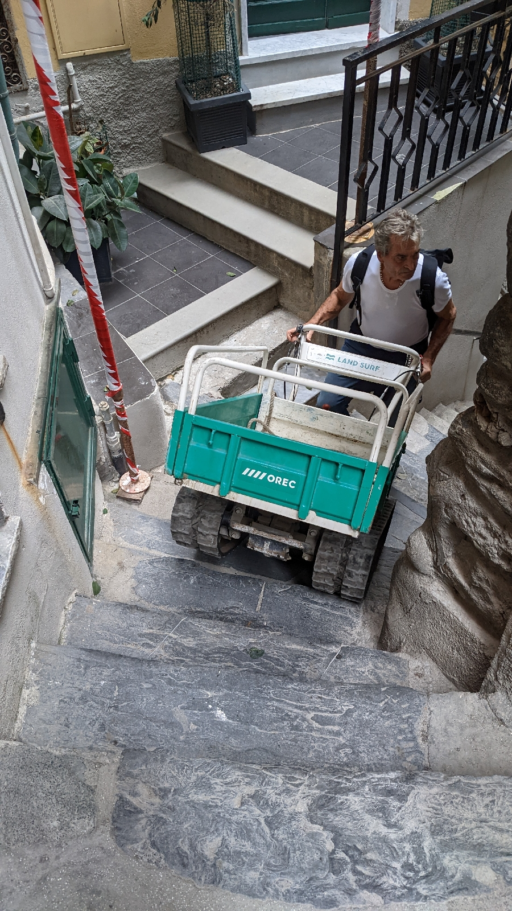

# Meien Sd
##### By G.dot
_Published on 2022-10-22T17:55:00.003+02:00_

Was haben nicht Menschen schon alles angestellt für ein friedliches Leben. Um vor Überfällen sicherer zu sein, sind südlich von Genua vor Jahrhunderten Dörfer auf Klippen hoch über dem Meer entstanden. Im Rücken ein unzugängliches Gebirge fühle man sich sicher. Schöne Blicke aufs Meer machen aber nicht satt. Zumindest nicht im Mittelalter. So kletterte man hinab zum Meer um zu fischen und Rang dem Gebirge einige Terrassen für Obst oder Wein ab.

  

  

Heute ist _Chinque Terre_ eines der touristischen Highlights an der ligurischen Küste. Massen von Amerikanern und Chinesen sagt der Reiseführer, sie sollen nun auf durchaus anspruchsvollen Wegen wandern. Trekking-Ausrüster machen gute Geschäfte.

  

  

Das tolle an dem Gebiet ist, daß die Orte mit einer Eisenbahnen verbunden sind. De facto ist es eher eine Tunnelbahn. Nur an den Orten kommt sie kurz zum Vorschein oder hält gleich unterirdisch. Damit ist die Wanderung beliebig einteilbar. Autos sind hier nutzlos.

  

  

Anmerkung zum Titel:

Die Gegend erinnerte mich an das Meißner Weinbaugebiet. Terrassen überall. Wein teuer.

Hier käme aber niemand auf die Idee, sich mit fremden Federn zu schmücken. Tzatziki-Berlin? Toskanisch Dresden? (Welche Umkehrung meine ich ?~) Wir im Norden haben offenbar einen Komplex und finden die echten Namen reichen nicht. Es muss immer eine _Schweiz_ sein, so lächerlich die Hügelei auch ist. Oder eben ein noch so abwegiger Bezug auf etwas vermeintlich schönes aus dem Süden. Egal. Der echte Süden ist schön. Nur, Leben da ist schon eine andere Nummer.

  

  

Nett im Urlaub, extrem mühsam im Alltag.

---
Categories: Geschichte,Länder