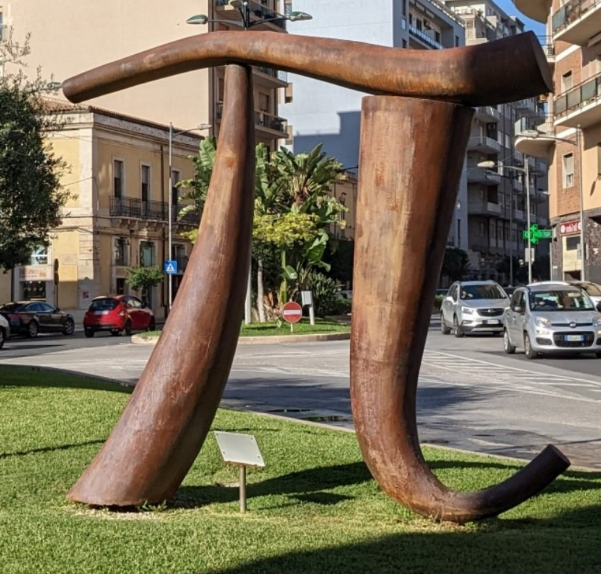

# Lesezeit zwei Minuten Nachhilfe fr Journalisten
##### By G.dot
_Published on 2022-10-23T08:36:00.001+02:00_

  

Wer Journalist wird, hatte wahrscheinlich nicht Mathematik als Lieblingsfach. Das merkt man vielen Beiträgen an. Daher kommt hier etwas Nachhilfe zu gesprochener oder geschriebener Mathematik. Es geht um die kleinen Wörter "um" und "auf". Gerne werden die benutzt, um Änderungen von Preisen oder Bruttosozialiprodukten in Textaufgaben zu verpacken. Es handelt sich aber nicht ohne Grund um zwei verschiedene Wörter.

Ich illustriere das mal an einem Beispiel, das mit gerade sehr nahe liegt: Als in Italien noch mit Lire bezahlt wurde, hat ein Espresso meist 500 Lire gekostet. Das sind rund 25 Eurocent. Als der Euro kam, waren es plötzlich 50 Cent geworden, was übrigens zu großem Unmut im Lande führte. Das ist eine Preissteigerungen **auf** das doppelte, also 200 Prozent und **um** das einfache - meist sagt man um 100 Prozent. Um bezeichnet also die Änderung, auf dagegen das gesamte. Diesen Zusammenhang liest und hört man reihenweise falsch.

Klar wird der Unterschied, wenn die Änderung nicht ein Vielfaches ist. Steigt der Preis des Espresso von einem Euro auf eins fünfzig, so ist klar, daß er **um** 50% und **auf** das anderthalb fache.

Bitte, bitte, bitte liebe Journalisten nehmt euch Zeit oder sucht Rat bei Themen, wo ihr nicht sattelfest seid. Eure Arbeit ist zu wichtig als daß sie durch Unwissen diskreditiert werden kann.

---
Categories: sonstiges