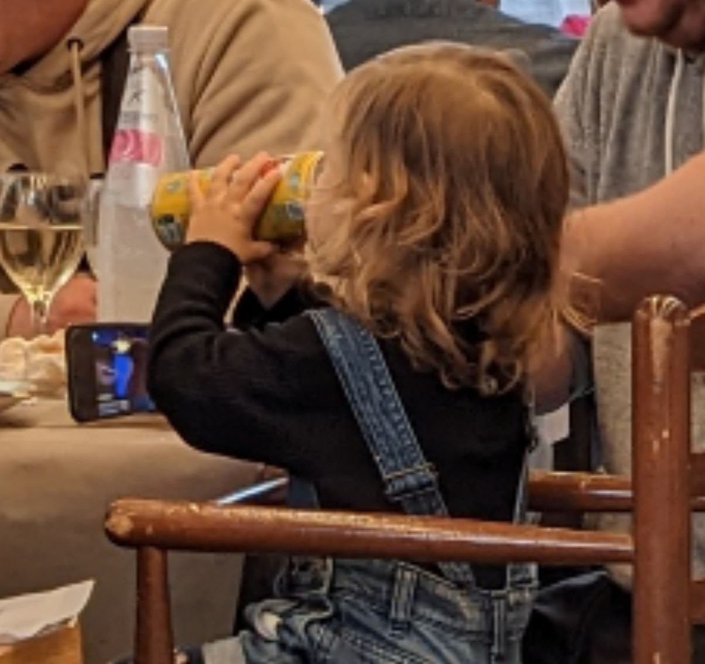

# Querformat
##### By G.dot
_Published on 2022-10-24T18:36:00.001+02:00_

Hier kommt ein Beitrag, der nicht unmittelbar mit meiner Reise zu tun hat. Es betrifft aber eine von mir häufig gemachte Beobachtung. Nicht selten sehe ich in Restaurants, den Zug oder anderswo Kinder, die mit Filmchen ruhiggestellt werden. Gerne begleitet von einem soft drink. Den Eltern kommt offenbar nicht die Idee, sich mit ihnen zu beschäftigen.

  

  

Ich frage mich dann, ob ich einfach zu alt bin, um das in Ordnung zu finden. Als ich Kind war, gab es Bücher. Die Elektronik macht Ablenkung leicht. Was macht das mit Kindern? Wie läuft Frühstück und Abendessen bei diesen Familien? Sind Bildschirme die Babysitter unserer Zeit? Welche Werte bekommt ein Kind, wenn es statt Teil der Gemeinschaft zu sein, vor einem Bildschirm geparkt wird? Und welches Verhältnis haben die Eltern zu ihrem Kind? Ich befürchte, es wächst eine Generation von Wischexperten mit massiven sozialen Defiziten heran.

  

Das sind natürlich nur Mutmaßungen eines Laien. Ich glaube aber einfach nicht, daß das gut ist. 

  

Bei älteren Kindern und Jugendlichen beobachte ich, daß sie in der Bedienung der Endgeräte und in den sogenannten sozialen Medien fit sind. Sie erkennen das Internet aber nicht als gigantische Bibliothek. Geschweige denn interessieren sie sich für die hinter den Geräten steckende Technik. Sie sind schlicht Konsumenten. 

Ich vergleiche das Internet gerne mit einem großen Zeitungskiosk. Man hat die freie Wahl, ob man _Die Bunte_ oder _Die Zeit_ wählt.

---
Categories: Kultur,sonstiges