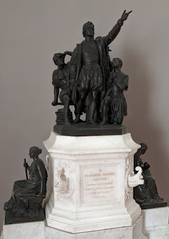
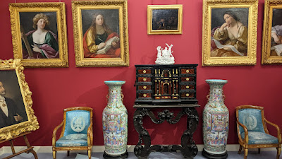
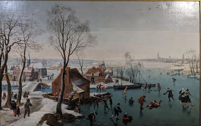
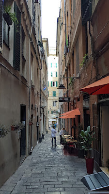

# Geburtshelfer des Kapitalismus
##### By G.dot
_Published on 2022-10-27T20:37:00.003+02:00_

  

Sicherlich wusste er nicht was er da ins Rollen brachte. Als Cristoforo Kolombo sich gen Westen aufmachte, suchte er nur einen Seeweg nach Indien. Das Ergebnis war aber die Geburt des modernen Kapitalismus. Ein lukrativer Dreieckshandel begann. Waren wurden nach Afrika verkauft, Menschen als Sklaven nach Amerika verschifft und von dort kam Baumwolle und anderes zurück nach Europa. Die Ausbeutung war total. Seine Heimatstadt Genua profitiere reichlich. Schiffsbau, Handel und Finanzierung gebar die ersten Oligarchen. Unfassbarer Reichtum ließ einen Palast an anderen entstehen. Die Könige des Kapitalismus lebten wie wie die echten.

  

  

Kein Prunk war zu viel. Die Paläste von damals sind wie die Superjachten von heute. 

Die Stadt zog große Geister an. Rubens malte, Davinci auch. Eine ganze Kolonie an malenden Holländern entstand.

  

  

Jan Wildens zeigt eine zugefrorene Bucht von Genua. Das scheint es wirklich gegeben zu haben in der sogenannten [kleinen Eiszeit](https://de.wikipedia.org/wiki/Kleine_Eiszeit).

Die Stadt selbst ist sehr sehenswert, aber auch anstrengend wie wohl alle italienischen Großstädte. 

  

  

Die sehr engen Gassen sind nach Einbruch der Dunkelheit auch nicht für jeden...

---
Categories: Geschichte,Kultur,Länder