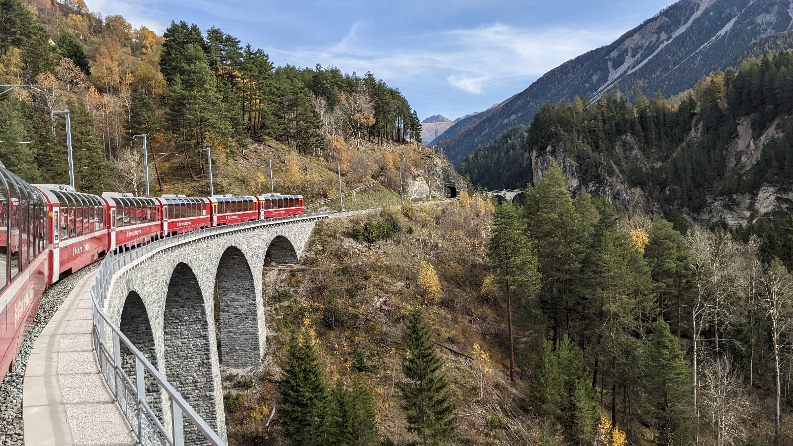

# Roaming Schweiz
##### By G.dot
_Published on 2022-10-30T08:37:00.002+01:00_

Das englische Wort roaming heißt eigentlich herumwandern. Das habe ich dem Wortsinne folgend ausgiebig gemacht. Oder besser machen lassen. Der Zug hat mich durch die Schweiz getragen.

Schon die Vorfreude auf Schmalspur in den Schweizer Bergen war groß. Die Begeisterung im Zug dann die eines kleinen Jungen, der eine tolle Spielzeugeisenbahn bekommt. Hier sogar mit fertiger Landschaft. Und was für welcher.

  

  

Man wird ganz trunken von den Aussichten. Ich habe sie aufgesogen. Die Kamera verrichtete Schwerstarbeit.

  

  

Dabei sitzt man warm, bequem und großzügig in der ersten Klasse. Ein Traum. Die Züge sind pünktlich, sauber und meistens sehr modern. Alle Anschlüsse klappen perfekt trotz sehr kurzer Umsteigezeiten. Und will man mal wo bleiben, kommt garantiert spätestens in einer Stunde der nächste Zug.

Ohne interrail hat das aber seinen Preis. Allein in den drei Tagen Schweiz habe ich den Gegenwert meines interrail-Tickets für zwei Monate verfahren. Und steigt man aus, traut man oft seinen Augen nicht. Gepäckfach am Bahnhof: 9 Franken.

  

Und jetzt noch zur modernen Bedeutung von _roaming_. Nachdem ich beim letzten Mal Schweiz mit Prepaid-Karten von Aldi einen totalen Reinfall erlebt habe ( Eine Stunde im Laden für die Registrierung und dann tagelang auf die Aktivierung warten....) fiel meine Wahl dieses Mal auf einem Anbieter von eSIM. Airalo heißt der und bietet eine Datenkarte auch für die Schweiz an. (1GB, 1 Woche, 5$) Die funktioniert prima. Keine Registrierung, nur App und Softwarezauber. Es sind ein paar Einstellungen am Telefon nötig, aber die sind gut erklärt. Krux: Nicht jedes Telefon hat eSIM.

---
Categories: Länder,Technik