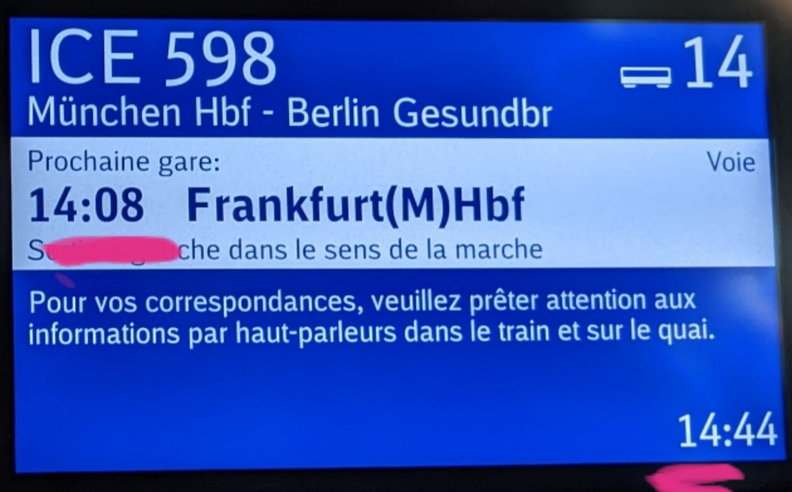

# 115
##### By G.dot
_Published on 2022-11-03T20:55:00.001+01:00_

Eigentlich wollte ich diesen Beitrag vermeiden. Aber er wurde nötig. Nachdem ich in fünfzehn Ländern Bahn fahren durfte, war am Ende die deutsche dran. Sie machte ihrem Ruf alle Ehre. Trotz 30 Minuten Umsteigezeit verpasste ich den Abschluss in Frankfurt. An Ende war das nicht schlimm, denn der verpasste ICE ging in Döbeln kaputt. Der Zug in dem ich dann saß sammelte die gestrandeten Passagiere auf. Es war schon fast lustig.

  

  

Selbst die Anzeige im Zug war verwirrt.

Früher dachte ich, das deutsche Streckennetz ist eben groß. Da sind Verspätungen unvermeidlich. Nun, auch Italien ist groß. Dort waren die meisten Züge sehr pünktlich. Und in der Schweiz klappen sogar Umsteigezeiten von zwei Minuten.

Auch ist Deutschland das einzige Land, das ich in den zwei Monaten bereist habe, in dem nach wie vor Maske Pflicht ist. Wenn ich in einer Gruppe eine von der großen Mehrheit abweichende Meinung habe, kommen mir Zweifel, ob meine Position wirklich die richtige ist. Es ist sehr heilsam, etwas über den Tellerrand zu schauen. Uns allen täte das öfter gut. Wir könnten sehen, daß Deutschland bei so einigen modernen Themen weit weg von der Avantgarde ist. Bei anderen, wie den erneuerbaren Energien, sieht es ganz gut aus - verglichen mit dem Balkan.

---
Categories: Länder,Planung,Reise,sonstiges