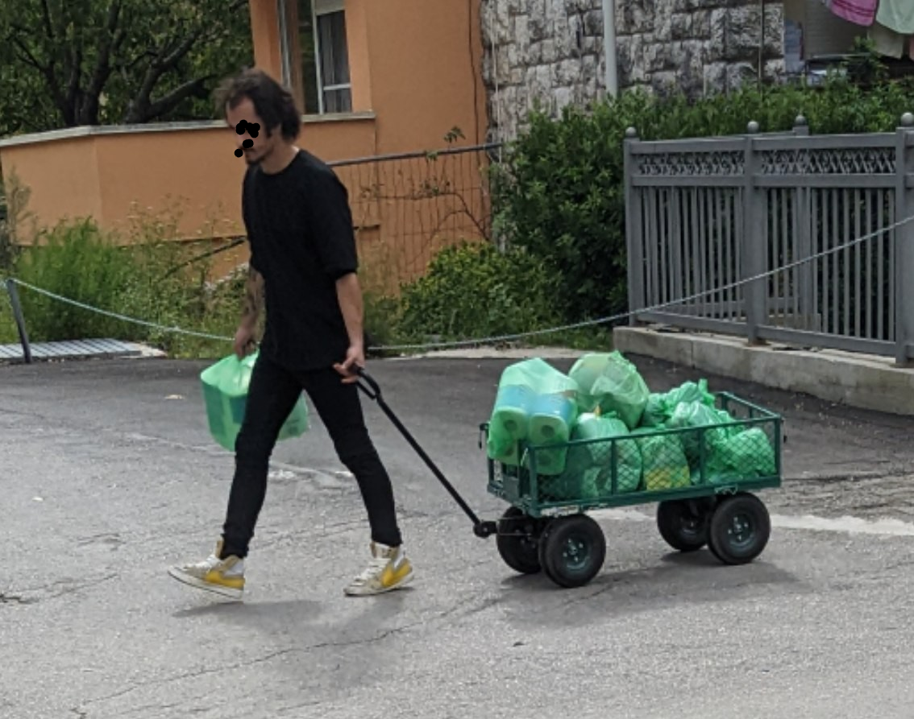

# Plastikwelt
##### By G.dot
_Published on 2022-11-05T13:45:00.002+01:00_

Zuhause ist es en vogue, so wenig wie möglich Plastik zu nutzen und wenn es doch sein muss dann wenig und lange. Auf meiner Reise habe ich schnell gelernt, daß das eine sonst selten anzutreffende Blase ist. Praktisch nirgends wird am Plastik gespart. Im Gegenteil. Nach wenigen Einkaufen in Supermärkten besaß ich plötzlich mehr Plastiktüten als ich Zuhause in einem Jahr bekomme. Die Tüten abzulehnen wirkt offenbar schrullig. Das macht keiner. Die Olivenbar feiert eine Plastikschachtelorgie. Bestehe ich auf nur einer Schachtel für verschiedene Sorten, bringe ich die Olivenfachverkäuferin an den Rand ihrer Fähigkeiten. Tara und so...

Auch gibt es nicht den Hauch einer Ahnung davon, daß die in den Fluss oder ins Meer gewehte Tüte das Ende einer Schildkröte bedeuten könnte.

  

  

Ich glaube schon, daß es richtig ist, unverrottbaren Müll zu vermeiden. Doch ein paar Willige werden es nicht reißen. Es helfen nur Verbote. Dafür brauchen wir kluge und mutige Politiker und eine Gesellschaft, die es gut findet, vereinbarte Regeln einzuhalten. Denn die helfen nichts, wenn sie nicht durchgesetzt werden. Im Gegenteil: Regeln, deren Bruch nicht zu Sanktionen führt, beschädigen das Vertrauen in diese. Dann ist der sich korrekt verhaltende der dumme. Das Schlitzohr kommt durch. Das ist zu Ende gedacht asozial. Dann besser keine Regel festlegen.

Beispiel: Vor einigen Jahren wurde mit viel Tamtam in Deutschland das Handyverbot am Steuer eingeführt. Wirf mal einen Blick in vorbeifahrende Handwerkerautos Montag früh! Sehr viele telefonieren mit Handy in der Hand. Von Polizeikontrollen, die das sanktionieren habe ich noch nicht gehört. Was soll dann die Regel?

---
Categories: sonstiges