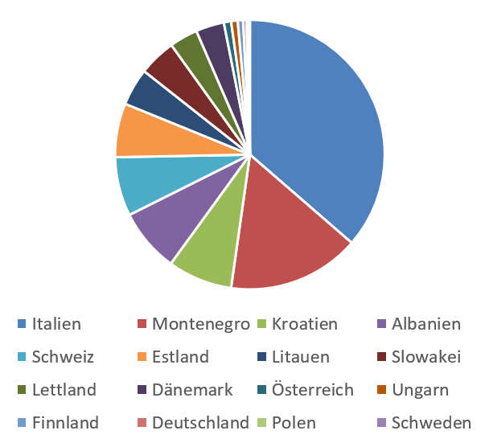
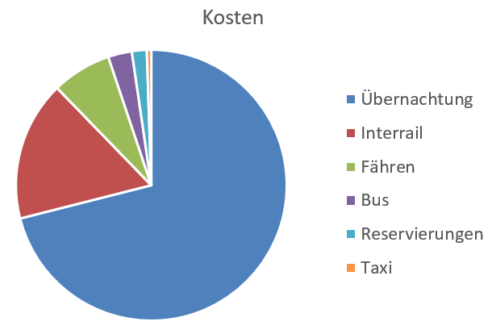

# Nachlese
##### By G.dot
_Published on 2022-11-07T16:40:00.003+01:00_

Als einer, der Zahlen mag, kann ich mir nicht verkneifen, einige dieser meiner nun beendeten Reise zusammenzufassen. Selbstvemessung mit kluger Uhr, Bezahlen mit Karte und andere Elektronik erinnern sich an vieles. Das interessiert andere, aber eben auch mich selbst.

Die Uhr zum Beispiel sagt, ich hätte über 754000 Schritte in den zwei Monaten gemacht. Schenkt man dem Glauben, waren das über zehn Kilometer täglich. Das schaffe ich im Arbeitsalltag nicht annähernd.

Interessiert hat mich auch, wie viel Zeit ich jeden Land gewidmet habe. Da die sehr unterschiedlich groß sind, habe ich die verbrachte Zeit auf deren Größe normiert:

  

  

Da gibt es einen klaren Gewinner. Italien. Mit Kalabrien, Sizilien, Chinque Terre und Genua ist es so vielfältig wie kaum ein anderes der besuchten Länder. Dazu Sonne, Kultur, Geschichte und gutes Essen. Dolce Vita.

Auf den zweiten Rang läuft Montenegro ein. Mit wildem Gebirge und Adriaküste ist es sehr sehenswert. Dafür hat es die mit Abstand hässlichste Hauptstadt.

Eine weitere Torte zeigt die Kostenverteilung der Tour.

  

  

Die Übernachtung immer in Pensionen, Ferienwohnungen oder Hotels saugt am Beutel. Schlafsäale, auch wenn oft erheblich günstiger, habe ich gemieden. Der Luxus eines halbwegs privaten Rückzugsortes kostet eben. Zudem war mir wichtig, immer in Stadtzentrum zu wohnen. So vermeidet man, Zeit in Verkehrsmitteln zu vertrödeln und kann die Stadt zu Fuß erschließen. 

Nach dem interrail-Ticket ist das drittgrößte Kuchenstück das Fähre fahren. Aber es ist auch einfach schön und bei der gewählten Route unvermeidlich.

das Zählen der gefahrenen Kilometer habe ich mir gespart. Aber immerhin habe ich [die Karte](https://www.spurtr.eu/p/karte.html) aktualisiert.

---
Categories: sonstiges