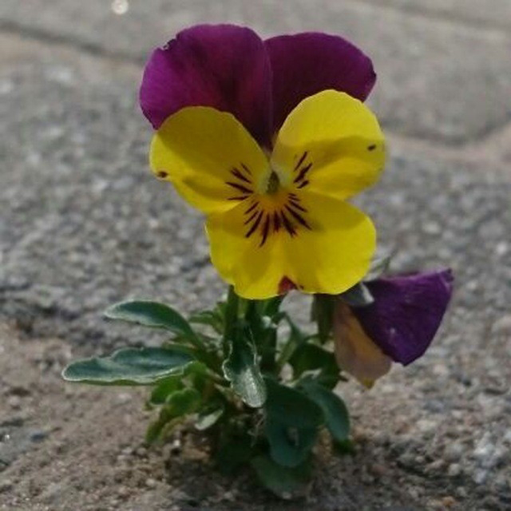

# Glck
##### By G.dot
_Published on 2022-12-31T12:13:00.001+01:00_

Heute ist mal wieder Zeit, ein paar Gedanken loszuwerden. Die mediale Art der Jahresrückblicke sieht weit überwiegend negatives. Krieg, Vertreibung, Krankheiten, Armut - das sind selbstverständlich schlimme Dinge. Die Mechanismen der Medien brauchen aber diese Ereignisse, um Aufmerksamkeit zu bekommen. Leider ist gutes und normales keine wirksame Überschrift.  

Wer nun im Warmen sitzt und diese Zeilen leist, ist sich meist nicht darüber im klaren, daß es tatsächlich aber um den Zustand der Menschheit besser als je zuvor bestellt ist. Dazu sei auf [einen älteren Artikel verwiesen](https://www.spurtr.eu/2022/09/mathematik.html). Was wir und zudem kaum klar machen ist, daß das, was wir meinen erreicht zu haben, weniger durch Fleiß und eigenes Geschick gekommen ist, sondern zu einem weit überwiegenden Teil just Glück ist.

Das fängt damit an, in der _richtigen_ Zeit geboren zu sein. Die meisten von uns wären in den vergangenen Jahrhunderten wahrscheinlich Bauern, Tagelöhner oder sonstiges unterprivilegiertes Volk gewesen. Daß wir jetzt leben, ist keine eigene Leistung.

Wie die [Landkarte meiner Leser](https://www.spurtr.eu/2022/10/was-ich-uber-euch-wei.html) zeigt, leben sie, wie ich, in einem der reichsten Länder der Erde. Auch dieser Ort der Geburt und damit die Chancen, ein erfolgreiches und sorgenarmes Leben zu führen, wurde uns geschenkt. Wir haben dazu nichts beigetragen. Ganz im Gegenteil: Wir kamen wahrscheinlich unter hervorragenden hygienischen Verhältnissen zur Welt, hatten jederzeit medizinische Versorgung und immer genug zu essen. Es gab Schulbildung und es gibt Arbeit. All das haben wir auf dem Gabentisch des Lebens gefunden. Nichts davon haben wir selbst erarbeitet. Ja, vielleicht hat sich der eine oder andere in der Schule angestrengt, um etwas besonderes zu werden. Andere haben irre viel gearbeitet, um sich etwas leisten zu können. Doch der Bauer in [Burundi](https://data.worldbank.org/indicator/NY.GDP.PCAP.CD?most_recent_value_desc=false) kann noch so schlau und fleißig sein. Er wird nie in einem Haus wie deinem leben, ein Einkommen wie deines haben. Es ist einfach Glück der Geburt, die Chance auf ein Leben in Frieden und Wohlstand verbringen zu dürfen.

Leider sind wir so gestrickt, daß wir unseren eigenen Beitrag regelmäßig überbewerten. die Psychologie nennt das _self-serving bias_ (es gibt auch einen [deutschen Begriff](https://de.wikipedia.org/wiki/Selbstwertdienliche_Verzerrung), aber die klingt eher unverständlich). Das führt zu einigen ungünstigen Verzerrungen. Da Entscheider offensichtlich erfolgreiche Leute sind, neigen sie dazu anzunehmen, daß vor allem eigenes Bemühen sie dahin gebracht hat. Sie unterschätzen - wie wir alle - den Anteil an Zufall und Glück. Nun kann man einwenden, daß bei gleichen Voraussetzungen der fleißige es zu etwas bringt, der faule eben weniger. Ja, richtig. Doch von zehn fleißigen, bekommt eben nur einer das Stipendium oder den begehrten Job. Der Anteil des Glücks bleibt hoch.

Daher wünsche ich uns allen etwas mehr Demut und Dankbarkeit. Wer auf der Sonnenseite der Welt lebt, sollte immer bedenken, daß das ein großes Glück ist und bereitwillig teilen mit Menschen, denen dieses Glück verwehrt blieb.

---
Categories: 