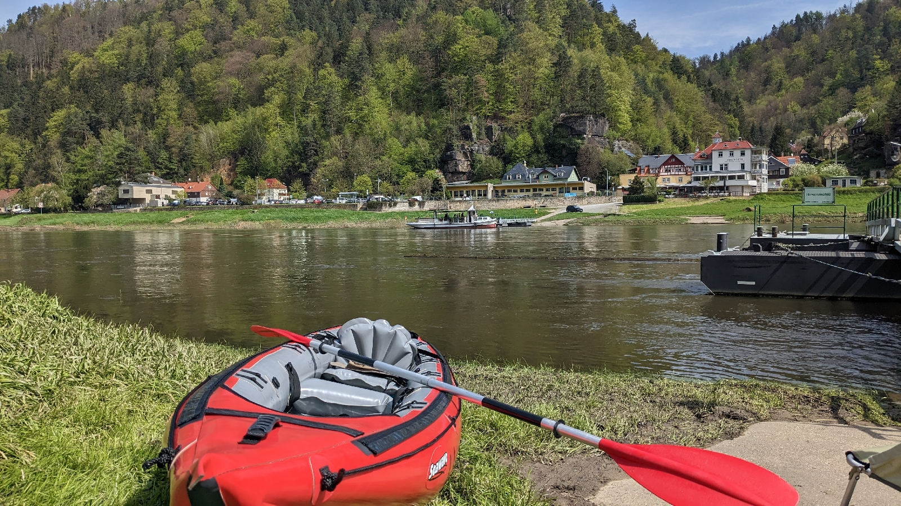
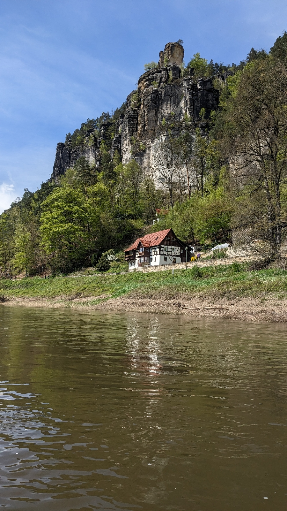
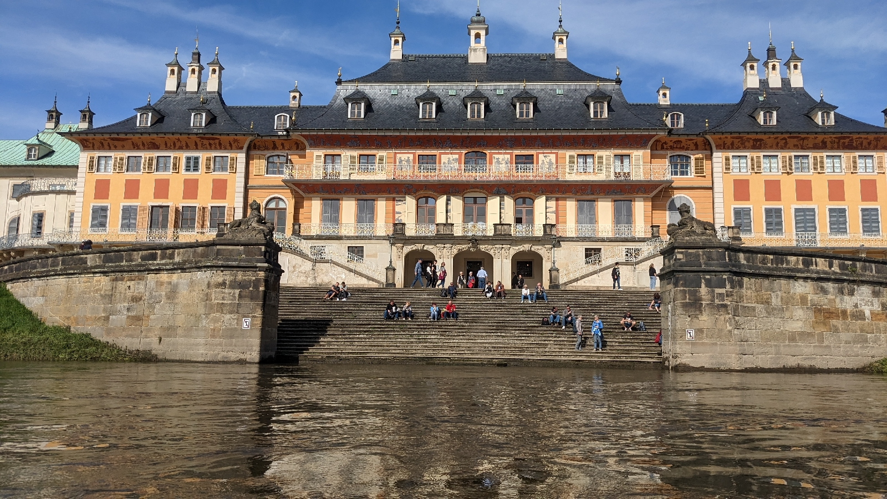

# Heraus zum ersten Mai
##### By G.dot
_Published on 2023-05-01T22:17:00.002+02:00_

Diese alte Arbeiterparole deute ich mal um. Heute startet das Neunundvierzig-Euro-Ticket und ich starte mit ihm. Ich beginne mal klassisch mit der S-Bahn ins Elbsandsteingebirge. Zurück ging es per Boot bei bestem Frühlingswetter. 

In loser Folge werde ich hier von meinem Touren mit dem Vierzig-Neuner berichten. Neue Länder werde ich damit nicht erobern, aber das Gute liegt ja oft so nah.

---
Categories: Natur,S-Bahn