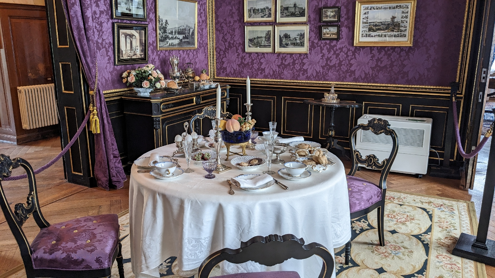

# Von Bad Muskau bis New York
##### By G.dot
_Published on 2023-05-07T14:31:00.004+02:00_

Nein, weder das eine noch das andere war heute das Ziel. Pückler war das Thema und sein Alterswerk [Park Branitz](https://www.pueckler-museum.de/park-schloss/der-branitzer-park/). 

Der war ein Maniker. Für seine Gärten verschuldete er sich bis zur Enteignung. Wenn er nicht Gärten gestaltete, reiste er durch die Welt. Bis in den Sudan. An allem Neuen war er interessiert. So taucht er auf den Grund der Themse oder nutzte Baumversetzwagen in seinem Park.

  

Auch war er bestens vernetzt. Kluge Köpfe seiner Zeit besuchen ihn auf seinem Landsitz.

  

  

Gärten in aller Welt, so auch der Central Park in Manhattan, wurden mit Bezug auf seine Ideen gestaltet. Er selbst wurde von anderen Fürsten als Gestalter engagiert.

  

Den Alterssitz Pücklers öffentlich zu erreichen ist eigentlich leicht, wenn auch nicht schnell. Eine Regionalbahn fährt von Dresden nach Cottbus. Dort gibt es einen Bus zum Park, der allerdings nur stündlich verkehrt. Ich hatte Pech durch Ersatzverkehr. Der bescherte mir aber auf den Rückweg noch einen Spaziergang durch Görlitz. Bahn.de fand, das sei der schnellste Rückweg.

---
Categories: Geschichte,Kultur,Natur