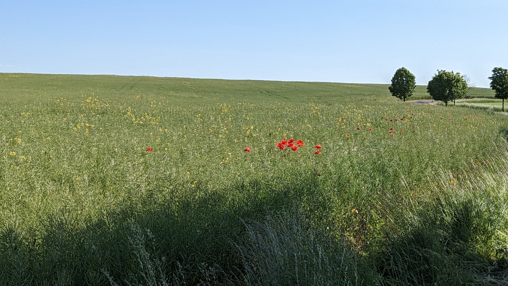
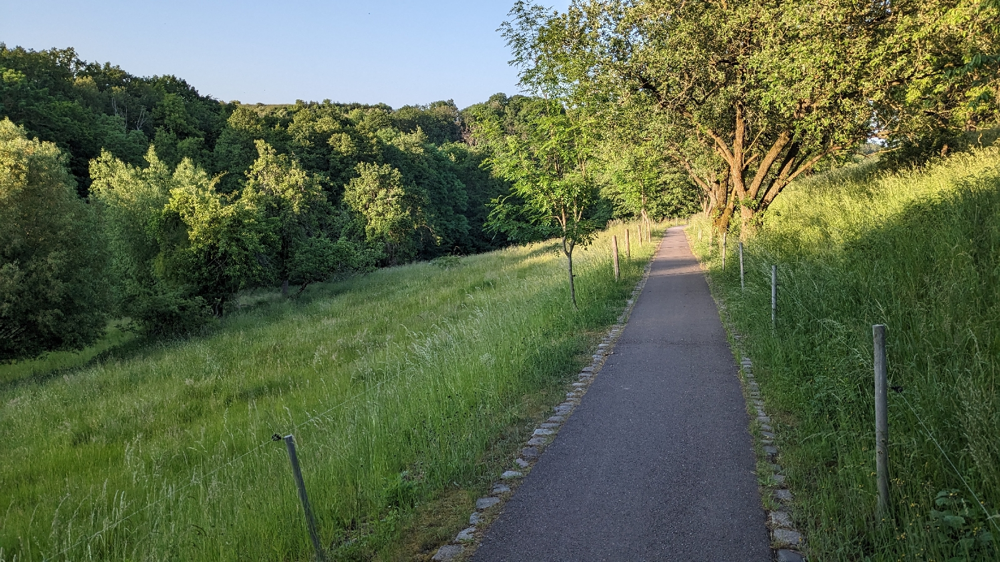

# Landpartie
##### By G.dot
_Published on 2023-06-04T18:14:00.030+02:00_

Es gibt versteckte Perlen, die man selbst nach vielen Jahren erst entdeckt. Eine davon ist der [saxstall](https://saxstall.de). Im verschlafenen Pohrsdorf am Tharandter Wald ist der pensionierte Apotheker Eckard Schleiermacher Musiker, Sammler und Mäzen des Jazz. Besonders das Saxophon hat es ihm angetan. Eine beeindruckende Sammlung an Instrumenten und Devotionalien ist jede Woche Kulisse feinster Konzerte. Wenn es das Wetter erlaubt, tönen die Instrumente im Schatten des Walnussbaums im Hof. 

  

  

Für den Hofherren ist nach eigener Aussage das sein "Apothekerporsche". Völlig zu Recht ist er fünf Mal mit dem deutschen Preis für herausragende Spielstätten ausgezeichnet worden. Dabei bewirtet er auch noch seine Gäste. Nur eine Spende wünscht er stilecht ins Saxophon.

Der Weg dahin ist eigentlich eine Sache fürs Auto. Der Bus fährt selten und abends nach dem Konzert gar nicht mehr. Aber warum nicht Kultur mit Bewegung an frische Luft verbinden? Die Linie 7 bringt einen in bequeme Radentfernung zum Ziel (10km; [Gompitzer Höhe](https://m.dvb.de/shared/1313463014) aussteigen). Auf der Strecke streift man Kesselsdorf und kommt über Feldweg und Nebenstraßen in etwa 30 Minuten hin. 

  

  

Für den Rückweg bietet sich der direkte Weg hinab nach Tharandt an. Allerdings ist das eine größere Straße. Netter aber weiter ist der Bahndamm der ehemaligen Schmalspurbahn Kesselsdorf - Potschappel. 

  

  

Auf dem rollt es gemütlich hinab nach Freital. Ab da bringt einen die S-Bahn zurück nach Dresden. Wenn die Energie noch reicht, ist der Weg entlang der Weißeritz aber auch leicht machbar.

  

Steckenstart ab der Haltestelle der Linie 7. gpx-track gibt es auf Anfrage

---
Categories: Fahrrad,Kultur,Natur,S-Bahn,Straßenbahn