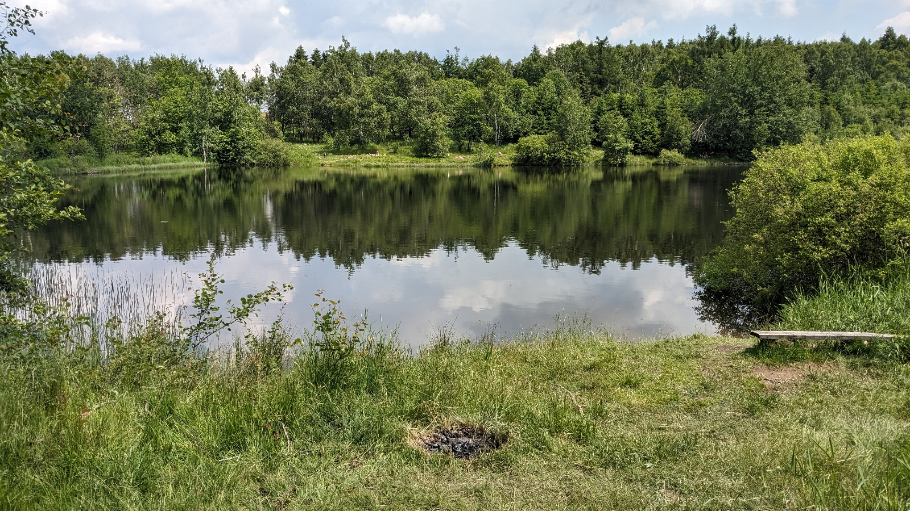

# Mein Klassiker
##### By G.dot
_Published on 2023-07-01T18:03:00.001+02:00_

Diese Runde habe ich schon unzählige Male gemacht. Nie gleich, nie langweilig, immer anspruchsvoll. Die Rede ist von der sogenannten [hohen Tour](https://hohetour.de/). Das ist eine Wander-, Rad- oder Skitour entlang der Grenze zwischen Sachsen und Böhmen zwischen der Elbe und Zinnwald im Erzgebirge. Meine heutige Variante sah den Zug nach Altenberg und mein Trekkingrad vor. Wider Erwarten war der Zug nicht voll und Räder passten problemlos rein. Im Felicia kühleren Altenberg hält man sich Richtung Zinnwald. Dafür kann man verschiedene Wege wählen. Dort wechsle ich auf die tschechische Seite. In Zinnovec, so der tschechische Name, kann man übrigens nett Baden.

  

  

Das bietet sich natürlich eher als Tourende an, wenn man bergauf von der Elbe kommend das Osterzgebirge erklommen hat.

  

Besonders reizvoll ist der Wechsel der Landschaften. Baumlose Höhen, einsame Wälder, Felsformationen und versteckte Teiche. 

  

  

Eigentlich ist die Tour wohl als Skitour erfunden worden. Aber besonders mit dem Rad im Sommer biete sie viel. Man kann das Rennrad nehmen und sich an Straßen halten. Das Mountainbike ist ideal für abgelegene Wege und es gibt downhills bis S2. Meine Trekking-Variante spricht sicher auch die Gräffl-Mode an. Rennlenker festhalten!  

  

Und die Harten starten an der Elbe. Dann geht es stetig bergauf. Ich war faul und rollte bergab und stieg ich Schöna in die S-Bahn. Selbst da kamen aber 67 Kilometer und über 600 Höhenmeter (nach oben) zusammen.

---
Categories: ÖPNV