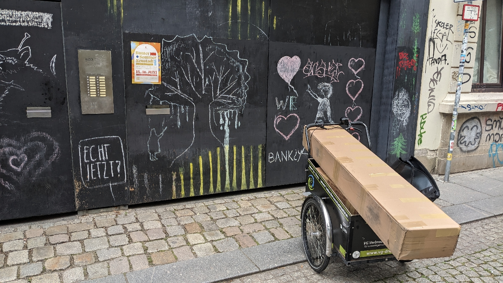
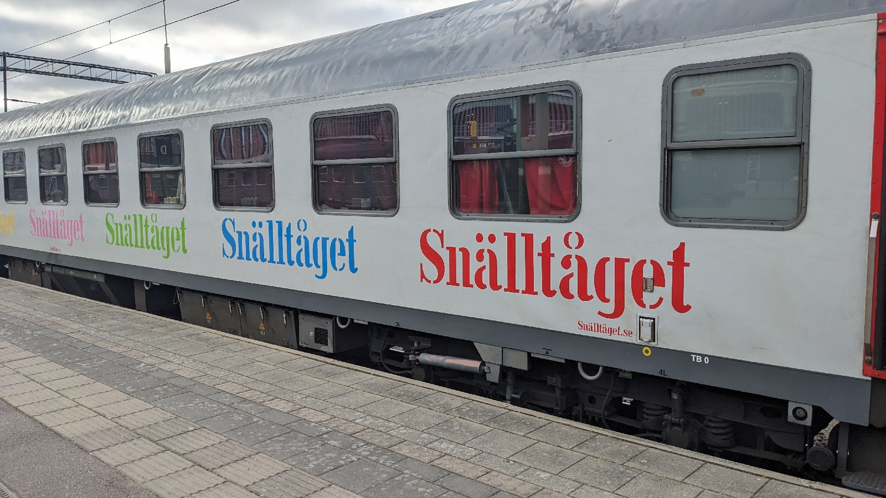
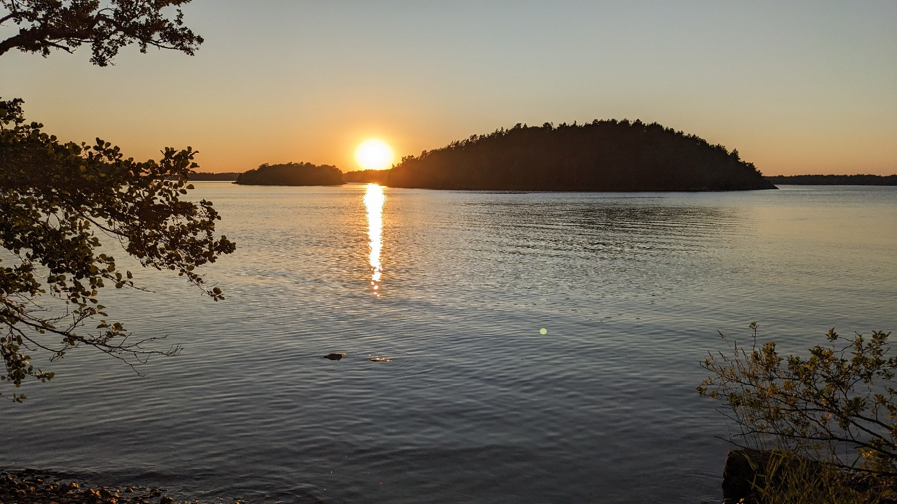

# Snlltget - per Nachtzug nach Stockholm
##### By G.dot
_Published on 2024-07-04T16:28:00.000+02:00_

Seit fast einem Jahr besitze ich kein Auto mehr. Vermisst habe ich nichts. Es gab wenige Situationen, in denen ein eigenes nötig gewesen wäre. 

  

Nun nun stand der nächste Sommerurlaub an. Wenn man nicht das Flugzeug nimmt, ist das Auto meist die erste Wahl. Die Ausrüstung für die vielen Freizeitvergnügen will transportiert sein. In meinem Fall war das Ziel Paddeln in den schwedischen Ostschären. 

  

Boote kann man natürlich mieten. Aber ich habe vier (gefaltete) im Keller und zwei Wochen Miete schlägt ins Kontour.

  

Warum also die Ausrüstung nicht per Post schicken? Ein Paketdienst, der nach Schweden liefert ist schnell gefunden und der Zeltplatz sagt ja. Also habe ich mächtige Kisten gepackt und mit einigem Vorlauf losgeschickt. 

Stilecht per Lastengrad zum Paketladen gebracht 

  

Ein paar Tage später trug uns der Nachtzug von Berlin nach Stockholm. Es ist ein schwedisches Unternehmen. Es war pünktlich.

Die Wagen sind historisch wertvoll und die Belegung eines Abteils im Liegewagen mit 6 Menschen und ihrem Gepäck grenzwertig. Aber es geht. 

  

Dafür waren die Pakete nicht angekommen. Es folgten entschleunigte Tage auf dem Zeltplatz. Mit ein paar Tagen Verspätung stachen wir dann aber mit zumindest einen eigenen Boot in See. Ziel in den Schären ist natürlich die Inbesitznahme einer eigenen Insel - zumindest für eine Nacht. 

  

Apropos Nacht. Wir waren zu Midsommer in Schweden. "Nacht" ist da eine Übertreibung. Es ist eher ein Dämmern, das man für Schlaf nutzen sollte. 

23h auf der eigenen Insel

---
Categories: 